# Database Schema

Every table needed to implement the OAN Ethiopia Grievance Portal, with all columns, keys and descriptions.

**Standing decisions.** Every `uuid` column in this document is **UUIDv7** — time-ordered, not random. See _Scale and operations_; the short version is that it is free today and a multi-week migration after launch. All timestamps are `timestamptz` in UTC. Nothing is hard-deleted.

**Key column legend:** `PK` primary key · `FK` foreign key · `UQ` unique · `IX` indexed · blank = plain column.

**Where this comes from:** the authority is the _Functional Specification Document: Ethiopia OAN – Grievance Management Module_ (v1.3, August 2026) — FR-01 to FR-11, the submitter-type matrix, workflows 4.1–4.3 and the non-functional requirements. The UI prototype in this repo is an early sketch shared for direction, not a specification: it is useful for seeing the intended shape of a screen, and it is not evidence of what a field is called, what values it takes, or whether it should exist. Where the two disagree, the FSD wins; where the prototype has something the FSD does not, it is a question, not a requirement.

Companion documents: `docs/grievance-lifecycle.md` (state definitions) and `docs/grievance-workflow-farmer.md` (the fully branched happy-and-unhappy-path walkthrough).

**41 tables** in ten groups.

| Group                    | Tables                                                                                                                                                             |
| ------------------------ | ------------------------------------------------------------------------------------------------------------------------------------------------------------------ |
| 1. Geography             | `administrative_areas`                                                                                                                                             |
| 2. Taxonomy              | `service_categories`, `grievance_types`, `document_types`                                                                                                          |
| 3. Organisation          | `departments`, `users`, `roles`, `user_roles`, `grievance_officers`, `officer_assignments`, `officer_assignment_categories`                                        |
| 4. Submitters            | `submitters`, `anonymous_requests`                                                                                                                                 |
| 5. Core grievance        | `grievances`, `grievance_attachments`, `grievance_duplicates`                                                                                                      |
| 6. Workflow definition   | `workflows`, `workflow_states`, `workflow_transitions`                                                                                                             |
| 6b. Workflow history     | `grievance_status_history`, `grievance_assignments`, `grievance_responses`, `grievance_timeline`, `grievance_feedback`                                             |
| 7. SLA & escalation      | `grievance_sla`, `sla_policies`, `global_sla_policy`, `business_calendars`, `calendar_holidays`, `sla_deferrals`, `grievance_escalations`, `reassignment_requests` |
| 8. Configuration         | `category_assignments`, `category_assignment_officers`, `response_templates`                                                                                       |
| 9. Notifications & audit | `notification_configs`, `notification_recipients`, `notification_log`, `audit_log`, `access_audit_log`, `sequence_counters`                                        |
| 10. Platform             | `case_timers`, `outbox_events`, `api_idempotency_keys`                                                                                                             |

### Design principle: one fact, one column

Three related rules, each of which removed something from an earlier draft of this document:

- **Derivable is not stored.** If a value can be reached by a join the query is doing anyway, it is not a column. A second copy has no way to be _checked_ against the first, so the two disagree eventually and nothing detects it.
- **Two settings for one behaviour is a bug.** Where two places could configure the same thing, one is deleted and the survivor is the one that actually fires.
- **A lookup nothing looks up is not a table.** If no foreign key points at it, no report groups by it, and its rows are written once at seed, it is an enum at best.

### Scope pairs: `(category_id, grievance_type_id)`

`workflows`, `sla_policies` and `response_templates` all bind to a category, a specific grievance type within it, or both. Since `grievance_types.category_id` already names the parent, the pair is redundant whenever the type is set — but the column is kept in all three, because a null type is what expresses "the whole category", and resolution is most-specific-first.

The redundancy is made safe rather than removed: each table carries `CHECK (grievance_type_id IS NULL OR category_id = (SELECT category_id FROM grievance_types WHERE id = grievance_type_id))`, enforced by trigger where a subquery in a `CHECK` is not allowed. Written once here rather than three times below.

### Design principle: events vs. state

Anything that **has happened** — resolution, closure, rejection, reassignment, reopening — is a row in a history table, never a column on `grievances`. Storing both is how the two drift apart. Only two kinds of thing stay materialised on the record itself: the **current** state the UI filters and sorts by, and **future deadlines**, which background jobs need an indexed scan to find. Everything else is derived.

---

## 0. Enumerated vocabularies

Closed value lists referenced by the tables below.

| Enum                   | Values                                                                                                               | Used by                                     |
| ---------------------- | -------------------------------------------------------------------------------------------------------------------- | ------------------------------------------- |
| `grievance_priority`   | Low, Medium, High, Critical                                                                                          | `grievances`, `sla_policies`                |
| `submitter_type`       | individual, cooperative, ngo, woreda_kebele, development_agent                                                       | `submitters`                                |
| `officer_level`        | L1, L2, nodal, senior_nodal                                                                                          | `users`, `global_sla_policy`                |
| `staff_status`         | Active, Inactive, On Leave                                                                                           | `users`                                     |
| `notification_channel` | SMS, Email                                                                                                           | `notification_configs`, `notification_log`  |
| `approval_status`      | Pending, Approved, Rejected                                                                                          | `sla_deferrals`, `reassignment_requests`    |
| `template_outcome`     | Resolved, Partially Resolved, Referred, Requires further info                                                        | `response_templates`, `grievance_responses` |
| `escalation_level`     | L1, L2                                                                                                               | `grievance_escalations`                     |
| `escalation_trigger`   | sla_breach, sla_2x_breach, manual_officer, manual_submitter                                                          | `grievance_escalations`                     |
| `closure_type`         | confirmed, auto_closed, rejected, referred                                                                           | `grievance_status_history`                  |
| `admin_level`          | federal, regional, zonal, woreda, kebele                                                                             | `users`                                     |
| `language`             | am, en                                                                                                               | `grievances`, `submitters`                  |
| `sla_behaviour`        | running, paused, stopped                                                                                             | `workflow_states`                           |
| `submission_channel`   | mobile_app, web_portal, ivr, call_centre, da_assisted                                                                | `grievances`                                |
| `identity_method`      | fayda, otp, org_registration, official_mandate, manual_verification                                                  | `submitters`                                |
| `sla_treatment`        | continue, reset, pause                                                                                               | `reassignment_requests`                     |
| `access_action`        | view_list, view_detail, view_attachment, export, view_submitter_identity                                             | `access_audit_log`                          |
| `recipient_type`       | submitter, assigned_officer, escalation_target, nodal_officer, department_head                                       | `notification_recipients`                   |
| `scan_status`          | pending, clean, infected, failed                                                                                     | `grievance_attachments`                     |
| `corrective_action`    | record_corrected, site_verification, referred_onward, written_clarification, no_action_required, other               | `grievance_responses`                       |
| `timeline_entry_type`  | note, message, response, info_request, info_response, status_change, assignment, escalation, attachment              | `grievance_timeline`                        |
| `timeline_visibility`  | public, internal, system                                                                                             | `grievance_timeline`                        |
| `timer_type`           | sla_reminder, sla_breach, sla_l2_breach, auto_close, info_request_deadline, workflow_auto_transition, triage_stalled | `case_timers`                               |
| `routing_strategy`     | primary_first, round_robin, least_loaded                                                                             | `category_assignments`                      |

`template_outcome` gains **Referred** because FSD FR-05 lists four response types, not three. Referral is expressed once, on the response: `outcome = 'Referred'` plus `referred_to_department_id`.

**Status is deliberately not an enum.** Grievance stages are rows in `workflow_states` (§6), not a fixed type — see that section for why. The nine values previously proposed here become the seed data of the default workflow.

---

## 1. Geography

A single nested-set tree replaces hardcoded regional/woreda tables so a deployment in any country is a data load rather than a schema migration.

One tree, one root (a synthetic **World** node; each country is a level-1 child). Depth is data, not schema.

### `administrative_areas`

| Column             | Type        | Key                                | Description                                                           |
| ------------------ | ----------- | ---------------------------------- | --------------------------------------------------------------------- |
| `id`               | uuid        | PK                                 | UUIDv7                                                                |
| `parent_id`        | uuid        | FK → `administrative_areas.id`, IX | Null only for the World root                                          |
| `country_id`       | uuid        | FK → `administrative_areas.id`, IX | The level-1 country ancestor, denormalised                            |
| `code`             | varchar(16) | UQ¹                                | Short code used in ticket IDs — `OROM`, `BISH`. Unique among siblings |
| `path_code`        | text        | UQ                                 | Materialised dotted code path — `ET.OROM.ESHW.ADAM.K01`               |
| `name`             | text        |                                    | Display name — "Adama". **Not unique** across the country             |
| `level_name`       | text        |                                    | Label for the tier — Region, Zone, Woreda, Kebele, County, Ward       |
| `depth`            | smallint    | IX                                 | 0 = World, 1 = Country, 2 = Region, etc.                              |
| `is_group`         | boolean     |                                    | False marks an operational leaf a grievance may attach to             |
| `lft`              | int         | IX                                 | Nested set left index                                                 |
| `rgt`              | int         | IX                                 | Nested set right index                                                |
| `valid_from`       | date        |                                    | When this division came into existence                                |
| `valid_to`         | date        | IX²                                | Null while current. Set when an area is dissolved or split            |
| `superseded_by_id` | uuid        | FK → `administrative_areas.id`     | Where territory moved on split/merge                                  |
| `created_at`       | timestamptz |                                    |                                                                       |
| `updated_at`       | timestamptz |                                    |                                                                       |

¹ Unique per `(parent_id, code)`.
² Partial index `WHERE valid_to IS NULL`.

---

## 2. Taxonomy

One canonical list of categories, referenced by routing, SLA policy, workflows and templates alike. Category names must exist in exactly one place, or the routing table and the SLA table drift into disagreeing about what "Inputs" is called.

### `service_categories`

| Column       | Type       | Key | Description                                                                     |
| ------------ | ---------- | --- | ------------------------------------------------------------------------------- |
| `id`         | uuid       | PK  |                                                                                 |
| `code`       | varchar(8) | UQ  | Used in ticket IDs — `INP`, `PAY`, `SCH`, `CRE`, `MKT`                          |
| `name`       | text       | UQ  | "Inputs", "Payments", "Schemes", "Credit", "Markets", "Infrastructure", "Other" |
| `sort_order` | int        |     | Display order in dropdowns                                                      |
| `is_active`  | boolean    |     | Soft-delete flag; inactive categories stay valid on historical grievances       |

### `grievance_types`

The specific issue within a category. Selected after the category, and filtered by it.

| Column        | Type    | Key                              | Description                                                             |
| ------------- | ------- | -------------------------------- | ----------------------------------------------------------------------- |
| `id`          | uuid    | PK                               |                                                                         |
| `category_id` | uuid    | FK → `service_categories.id`, IX | Parent category                                                         |
| `name`        | text    | UQ¹                              | "Weighing / measurement dispute", "Fertilizer non-delivery or shortage" |
| `is_active`   | boolean |                                  | Soft-delete flag                                                        |

¹ Unique per `(category_id, name)`.

### `document_types`

The supporting-documents checklist offered at submission: identification, landholding certificate, registration document, site sketch, previous correspondence, other. Made a table rather than an enum because the list is domain-specific and will differ per category once the module covers more than land and agriculture.

| Column        | Type    | Key                          | Description                              |
| ------------- | ------- | ---------------------------- | ---------------------------------------- |
| `id`          | uuid    | PK                           |                                          |
| `name`        | text    | UQ                           | "Copy of Identification Document"        |
| `category_id` | uuid    | FK → `service_categories.id` | Null = offered for every category        |
| `is_required` | boolean |                              | Whether submission is blocked without it |
| `sort_order`  | int     |                              | Checklist order on the form              |
| `is_active`   | boolean |                              |                                          |

`document_types` earns its place because other things point at it: `grievance_attachments.document_type_id` classifies every uploaded file, and the checklist is scoped per category. It is referenced configuration, not a display list.

**A `corrective_actions` _table_ was proposed here and removed; the field survives as an enum.** The table failed three tests: nothing in the schema referenced it, its rows would have been written once at seed and never again, and no report in FR-09 groups by it. Six values written once and joined on every read is an enum wearing a table costume.

The _field_ was kept for a different reason. It cannot be reconstructed later: officers write prose, and "sorted it out with the woreda office" cannot reliably be classified after the fact into _record corrected_ versus _referred onward_ — not by a human reading it years later, and not defensibly by text mining in a report a government has to stand behind. A nullable column costs nothing if the breakdown is never wanted, and is the only way to have the history if it is. It lives on `grievance_responses` as `corrective_actions` (§6b), typed and multi-valued.

Promote it back to a table only if the options need to differ per service category, which nothing currently asks for.

---

## 3. Organisation

Nodal Officers and Senior Nodal Officers are **not** separate entities — they are `users` distinguished by `officer_level`, with `reports_to_user_id` capturing the L1 → L2 link that escalation walks.

### `departments`

| Column       | Type        | Key | Description                                                                                                          |
| ------------ | ----------- | --- | -------------------------------------------------------------------------------------------------------------------- |
| `id`         | uuid        | PK  |                                                                                                                      |
| `name`       | text        | UQ  | "Inputs Supply & Distribution Agency"                                                                                |
| `short_name` | text        |     | "MoA", "ATI", "AFI", "EABC"                                                                                          |
| `email`      | citext      |     | Departmental mailbox FR-08 notifications are addressed to — the FSD's Department entity is _(name, email, officers)_ |
| `phone`      | varchar(24) |     | Switchboard or duty number                                                                                           |
| `is_active`  | boolean     |     | Soft-delete flag                                                                                                     |

**An `offices` table was proposed here and removed.** It would have modelled the administrative unit that receives and closes a grievance — "Lemi Kura Sub-City Administration" — as distinct from the functional department that does the work. The distinction is real in Ethiopian practice. The table was not.

### `roles`

| Column        | Type  | Key | Description                  |
| ------------- | ----- | --- | ---------------------------- |
| `id`          | uuid  | PK  |                              |
| `name`        | text  | UQ  | See the seed list below      |
| `description` | text  |     |                              |
| `permissions` | jsonb |     | Permission map for this role |

Seeded with: Case Officer, Senior Investigator, Department Head, Administrator, Auditor. RBAC is deny-by-default (FR-01) — a role with no permission entry can do nothing.

**Roles are not officer levels.** `users.officer_level` (L1 / L2 / nodal / senior_nodal) is a position in the escalation chain; a role is a bundle of permissions. Nodal Officer is deliberately absent from the seed list above, because it is a level — putting it in both places creates two answers to "is this person a nodal officer?" and no rule for which wins.

### `users`

Staff authentication and login accounts.

| Column          | Type        | Key | Description                       |
| --------------- | ----------- | --- | --------------------------------- |
| `id`            | uuid        | PK  |                                   |
| `email`         | citext      | UQ  | Login identity                    |
| `phone`         | varchar(24) |     |                                   |
| `password_hash` | text        |     | Null when the account is SSO-only |
| `is_active`     | boolean     |     | Active login toggle               |
| `last_login_at` | timestamptz |     |                                   |
| `created_at`    | timestamptz |     |                                   |
| `updated_at`    | timestamptz |     |                                   |

### `grievance_officers`

The verifier master entity (1:1 with `users`). Stores operational profile, global availability, and escalation reporting chain.

| Column                  | Type        | Key                          | Description                                                                  |
| ----------------------- | ----------- | ---------------------------- | ---------------------------------------------------------------------------- |
| `id`                    | uuid        | PK                           |                                                                              |
| `user_id`               | uuid        | FK → `users.id`, UQ          | Bound user login account                                                     |
| `full_name`             | text        |                              | Officer's full name                                                          |
| `email`                 | citext      | UQ                           | Official contact email                                                       |
| `phone`                 | varchar(24) |                              | Official duty phone                                                          |
| `job_title`             | text        |                              | Designation / Title                                                          |
| `reports_to_officer_id` | uuid        | FK → `grievance_officers.id` | Self-reference: the supervisor this officer escalates to                     |
| `staff_status`          | enum        | IX                           | `Active`, `Inactive`, `On Leave`. If `On Leave`, all child assignments pause |
| `max_open_cases`        | int         |                              | Global caseload ceiling for load balancing. Null = no ceiling                |
| `open_case_count`       | int         |                              | Maintained counter of active assigned cases                                  |
| `is_active`             | boolean     |                              | Master active toggle                                                         |
| `created_at`            | timestamptz |                              |                                                                              |
| `updated_at`            | timestamptz |                              |                                                                              |

### `officer_assignments`

1:N child table inside `grievance_officers`. Models geographic jurisdiction, line department, domain level, and temporary/acting coverages.

| Column                   | Type    | Key                                | Description                                                                    |
| ------------------------ | ------- | ---------------------------------- | ------------------------------------------------------------------------------ |
| `id`                     | uuid    | PK                                 |                                                                                |
| `officer_id`             | uuid    | FK → `grievance_officers.id`, IX   | Parent officer                                                                 |
| `administrative_area_id` | uuid    | FK → `administrative_areas.id`, IX | Scopes geographic visibility (Woreda / Region tree node)                       |
| `area_lft`               | int     |                                    | Denormalised tree interval bounds                                              |
| `area_rgt`               | int     |                                    |                                                                                |
| `department_id`          | uuid    | FK → `departments.id`, IX          | Line department. **NULL for Nodal officers**                                   |
| `role_level`             | enum    |                                    | `l1_case_officer`, `l2_supervisor`, `nodal`, `senior_nodal`, `department_head` |
| `is_primary`             | boolean |                                    | `1` = Permanent primary post, `0` = Acting / Dual Charge / Coverage            |
| `valid_from`             | date    |                                    | Activation start date                                                          |
| `valid_to`               | date    |                                    | Expiration date. `NULL` = Indefinite                                           |
| `is_active`              | boolean |                                    | Active assignment toggle                                                       |

### `officer_assignment_categories`

Specialized domain category bindings for an assignment. If empty, the officer handles **all categories** within their department and area.

| Column          | Type | Key                               | Description              |
| --------------- | ---- | --------------------------------- | ------------------------ |
| `id`            | uuid | PK                                |                          |
| `assignment_id` | uuid | PK, FK → `officer_assignments.id` | Parent assignment        |
| `category_id`   | uuid | PK, FK → `service_categories.id`  | Handled service category |

### `user_roles`

Join table; a user may hold more than one role.

| Column       | Type        | Key                 | Description           |
| ------------ | ----------- | ------------------- | --------------------- |
| `user_id`    | uuid        | PK, FK → `users.id` |                       |
| `role_id`    | uuid        | PK, FK → `roles.id` |                       |
| `granted_at` | timestamptz |                     |                       |
| `granted_by` | uuid        | FK → `users.id`     | Who assigned the role |

---

## 4. Submitters

### `submitters`

A **durable party record**, not a per-submission record.

| Column                   | Type        | Key                                | Description                                                                                                                                                                                                |
| ------------------------ | ----------- | ---------------------------------- | ---------------------------------------------------------------------------------------------------------------------------------------------------------------------------------------------------------- |
| `id`                     | uuid        | PK                                 |                                                                                                                                                                                                            |
| `submitter_type`         | enum        |                                    | individual / cooperative / ngo / woreda_kebele / development_agent                                                                                                                                         |
| `full_name`              | text        |                                    | Person's name, or the organisation's registered name                                                                                                                                                       |
| `fayda_id`               | varchar(32) | IX                                 | National ID. Nullable — anonymous submissions are allowed                                                                                                                                                  |
| `phone`                  | varchar(24) | IX                                 |                                                                                                                                                                                                            |
| `email`                  | citext      |                                    |                                                                                                                                                                                                            |
| `preferred_language`     | enum        |                                    | `am` / `en` — chooses which template translation is sent                                                                                                                                                   |
| `occupation`             | text        |                                    | "Farmer / Landholder"                                                                                                                                                                                      |
| `farmer_id`              | varchar(64) | IX                                 | OAN farmer registry identifier — the Individual Farmer type's "Farmer ID"                                                                                                                                  |
| `identity_method`        | enum        |                                    | How this submitter was proven: fayda / otp / org_registration / official_mandate / manual_verification. Records the FR-01 fallback path actually used                                                      |
| `identity_verified_at`   | timestamptz |                                    | Null when identity was never verified — e.g. an IVR caller taken on trust                                                                                                                                  |
| `administrative_area_id` | uuid        | FK → `administrative_areas.id`, IX | Submitter's home administrative area node                                                                                                                                                                  |
| `kebele`                 | text        |                                    | Free text as entered                                                                                                                                                                                       |
| `registration_no`        | varchar(64) |                                    | Cooperative / NGO registration — `COOP-XX-2024-XXXX`                                                                                                                                                       |
| `representative_name`    | text        |                                    | Named representative for an organisation — the authorised rep for cooperative, NGO and woreda/kebele body submissions                                                                                      |
| `area_covered`           | text        |                                    | NGO only: the geography the organisation operates across                                                                                                                                                   |
| `administrative_unit`    | text        |                                    | Woreda/kebele body only: the unit the submitting body speaks for                                                                                                                                           |
| `dedupe_key`             | text        | UQ                                 | The identity this party is matched on — `fayda:1234…`, `org:COOP-XX-2024-0001`, `phone:+2519…` when no stronger identifier exists. Makes "same person, second grievance" a lookup instead of a fuzzy match |
| `is_blocked`             | boolean     |                                    | Set only for demonstrated abuse; blocks new submissions, never hides existing ones                                                                                                                         |
| `created_at`             | timestamptz |                                    |                                                                                                                                                                                                            |
| `updated_at`             | timestamptz |                                    |                                                                                                                                                                                                            |

### `anonymous_requests`

Anonymous submission is allowed only through an approval workflow, and only where enabled. `grievances.is_anonymous` records the _outcome_; this table holds the decision —

| Column               | Type        | Key                      | Description                                                     |
| -------------------- | ----------- | ------------------------ | --------------------------------------------------------------- |
| `id`                 | uuid        | PK                       |                                                                 |
| `grievance_id`       | uuid        | FK → `grievances.id`, UQ | The grievance being filed anonymously                           |
| `justification`      | text        |                          | Why the submitter is seeking anonymity — fear of reprisal, etc. |
| `status`             | enum        | IX¹                      | Pending / Approved / Rejected                                   |
| `decided_by_user_id` | uuid        | FK → `users.id`          | The approver                                                    |
| `decided_at`         | timestamptz |                          |                                                                 |
| `decision_note`      | text        |                          |                                                                 |
| `created_at`         | timestamptz |                          |                                                                 |

---

## 5. Core grievance

### `grievances`

The central table. This is what the All-Grievances table renders and the detail sidebar edits.

| Column                      | Type        | Key                                | Description                                                                                                                                                                                                           |
| --------------------------- | ----------- | ---------------------------------- | --------------------------------------------------------------------------------------------------------------------------------------------------------------------------------------------------------------------- |
| `id`                        | uuid        | PK                                 |                                                                                                                                                                                                                       |
| `ticket_id`                 | varchar(32) | UQ                                 | Human-facing reference — `OROM-BISH-INP-09905`, format `PATH_CODE_SEGMENTS-CATEGORY-SEQ`                                                                                                                              |
| `submitter_id`              | uuid        | FK → `submitters.id`, IX           | The **owner** of the grievance. For a Development Agent filing, this is the farmer, never the agent. **Null once anonymity is approved** — see below                                                                  |
| `submitter_pseudonym`       | bytea       | IX                                 | `HMAC(service_key, submitter_id)`. Stable and deterministic, so two grievances from the same anonymous person group together, but not reversible to a person                                                          |
| `submitter_identity_sealed` | bytea       |                                    | The submitter id and the contact details needed to notify them, encrypted under a key held outside this database. Set only for approved-anonymous cases                                                               |
| `filed_by_user_id`          | uuid        | FK → `users.id`                    | The staff member who keyed it in — Development Agent, call-centre operator. Null for self-service. Recorded for audit; confers no ownership                                                                           |
| `members_affected`          | int         |                                    | Cooperative/FPO filings: how many members this grievance covers                                                                                                                                                       |
| `is_anonymous`              | boolean     |                                    | Whether _this_ grievance is handled anonymously. The decision lives in `anonymous_requests`; this is the enforced outcome                                                                                             |
| `title`                     | text        |                                    | One-line summary shown in the table's Details column                                                                                                                                                                  |
| `description`               | text        |                                    | The complainant's full narrative                                                                                                                                                                                      |
| `expected_resolution`       | text        |                                    | "What is the expected resolution for this grievance?"                                                                                                                                                                 |
| `category_id`               | uuid        | FK → `service_categories.id`, IX   | Drives routing and SLA                                                                                                                                                                                                |
| `grievance_type_id`         | uuid        | FK → `grievance_types.id`          | Specific issue type within the category                                                                                                                                                                               |
| `administrative_area_id`    | uuid        | FK → `administrative_areas.id`, IX | **Incident** location leaf node (`is_group = false`, `valid_to IS NULL`)                                                                                                                                              |
| `area_lft`                  | int         | IX                                 | Denormalised tree interval left bound for single-table range filtering                                                                                                                                                |
| `area_path_code`            | text        |                                    | Immutable snapshot of dotted code path at submission time (e.g. `ET.OROM.ESHW.ADAM.K01`)                                                                                                                              |
| `kebele`                    | text        |                                    | Free text as entered                                                                                                                                                                                                  |
| `facility_name`             | text        |                                    | "Input store, cooperative, bank, or market name (if applicable)"                                                                                                                                                      |
| `channel`                   | enum        | IX                                 | How the grievance arrived: mobile_app / web_portal / ivr / call_centre / da_assisted. See the note below on why this is a column and not a table                                                                      |
| `client_submission_uuid`    | uuid        | UQ                                 | Generated on the client. The idempotency key for offline sync — a replayed submission collides here instead of creating a second ticket                                                                               |
| `state_id`                  | uuid        | FK → `workflow_states.id`, IX      | Current lifecycle stage, and the _only_ workflow column on this table. Replaces the former `status` enum                                                                                                              |
| `priority`                  | enum        |                                    | Low / Medium / High / Critical, set at triage                                                                                                                                                                         |
| `department_id`             | uuid        | FK → `departments.id`, IX          | Owning department                                                                                                                                                                                                     |
| `assigned_officer_id`       | uuid        | FK → `users.id`, IX                | Current handling officer                                                                                                                                                                                              |
| `is_escalated`              | boolean     | IX                                 | Overlay flag, never a status (FR-04). Materialised because the work queue filters on it; the _level_ is not, because that is one join to the open `grievance_escalations` row and a second copy would only ever drift |
| `language`                  | enum        |                                    | `am` / `en` — the language all correspondence on this case uses                                                                                                                                                       |
| `submitted_at`              | timestamptz |                                    | When the **client** says the record was created — device clock, captured offline                                                                                                                                      |
| `created_at`                | timestamptz | IX                                 | When the **server** received it. Equal to `submitted_at` for online submissions; later by the length of the outage for synced ones                                                                                    |
| `updated_at`                | timestamptz |                                    |                                                                                                                                                                                                                       |
| `version`                   | int         |                                    | Optimistic-lock counter, incremented on every write. See below                                                                                                                                                        |
| `response_count`            | int         |                                    | Maintained count of submitter-visible responses and comments                                                                                                                                                          |
| `last_activity_at`          | timestamptz | IX                                 | Timestamp of the most recent event of any kind. The work queue's default sort                                                                                                                                         |

`submitter_identity_sealed` is envelope-encrypted under a key in a KMS or HSM, never in the database. Unsealing is a privileged operation that writes `access_audit_log.view_submitter_identity`. That is what makes "retained for audit" and "hidden from officers" true at the same time rather than in tension.

**What this does not solve, and nobody should pretend otherwise.**

**Concurrency.** A case officer and a nodal officer editing the same grievance is not a rare race at this scale, it is a Tuesday. `version` gives every update a `WHERE id = ? AND version = ?` guard, so the loser gets a conflict to resolve rather than silently overwriting the winner. Last-write-wins is not acceptable on a record that carries legal weight.

`response_count` is denormalised, on purpose

**Derived, deliberately not stored here:**

| Was                        | Now comes from                                                                                                              |
| -------------------------- | --------------------------------------------------------------------------------------------------------------------------- |
| `resolved_at`, `closed_at` | The `created_at` of the matching row in `grievance_status_history`                                                          |
| `closed_reason`            | `grievance_status_history.closure_type`                                                                                     |
| `rejection_reason`         | `grievance_status_history.reason` on the → Rejected row                                                                     |
| `closed_by`                | `grievance_status_history.changed_by_user_id` on the → Closed row, which is the officer of record FR-05 requires at closure |
| All `sla_*` columns        | `grievance_sla` (§7)                                                                                                        |

### `grievance_attachments`

Evidence files, from the original submission and from officer responses.

| Column                     | Type        | Key                           | Description                                                                                                                                |
| -------------------------- | ----------- | ----------------------------- | ------------------------------------------------------------------------------------------------------------------------------------------ |
| `id`                       | uuid        | PK                            |                                                                                                                                            |
| `grievance_id`             | uuid        | FK → `grievances.id`, IX      | Cascade delete                                                                                                                             |
| `response_id`              | uuid        | FK → `grievance_responses.id` | Set when the file was attached to an officer response rather than the original submission                                                  |
| `document_type_id`         | uuid        | FK → `document_types.id`      | Which item on the supporting-documents checklist this file satisfies                                                                       |
| `file_name`                | text        |                               | Original upload name                                                                                                                       |
| `storage_key`              | text        |                               | S3/MinIO object key — never store blobs in the database                                                                                    |
| `mime_type`                | text        |                               | Sniffed server-side, never trusted from the client                                                                                         |
| `size_bytes`               | bigint      |                               |                                                                                                                                            |
| `checksum_sha256`          | bytea       | IX                            | Content hash. Deduplicates re-uploads of the same photo across a case, and proves an evidence file has not been swapped since it was filed |
| `scan_status`              | enum        | IX¹                           | pending / clean / infected / failed                                                                                                        |
| `uploaded_by_user_id`      | uuid        | FK → `users.id`               | Set when an officer uploaded it                                                                                                            |
| `uploaded_by_submitter_id` | uuid        | FK → `submitters.id`          | Set when the submitter uploaded it                                                                                                         |
| `created_at`               | timestamptz |                               |                                                                                                                                            |

¹ Partial index `WHERE scan_status = 'pending'` — the scanner's queue.

Constraint: at least one of the two uploader columns must be non-null.

**Nothing is served before it is scanned.** A public-intake system accepts arbitrary files from the internet and then hands them to government staff to open — an unscanned attachment pipeline is a malware distribution channel with an official letterhead. `scan_status` gates download; `infected` files keep their row and their audit trail and lose their object. `checksum_sha256` covers the other half: evidence whose integrity cannot be demonstrated is not evidence.

### `grievance_duplicates`

Backs the duplicate-detection notification (`EC-002`).

| Column                      | Type         | Key                       | Description                                                                                                  |
| --------------------------- | ------------ | ------------------------- | ------------------------------------------------------------------------------------------------------------ |
| `id`                        | uuid         | PK                        |                                                                                                              |
| `grievance_id`              | uuid         | FK → `grievances.id`, UQ¹ | The newly filed grievance                                                                                    |
| `duplicate_of_grievance_id` | uuid         | FK → `grievances.id`, UQ¹ | The existing grievance it may duplicate                                                                      |
| `detected_at`               | timestamptz  |                           |                                                                                                              |
| `similarity_score`          | numeric(5,4) |                           | 0–1 confidence from the detection algorithm; lets the threshold be tuned against outcomes instead of guessed |
| `detection_method`          | text         |                           | Which rule fired — `fayda_recent_similar`, `text_similarity`, `manual`                                       |
| `confirmed_by_user_id`      | uuid         | FK → `users.id`           | Triage officer who ruled on it                                                                               |
| `is_confirmed`              | boolean      |                           | Null = flagged and awaiting a triage decision                                                                |
| `submitter_justification`   | text         |                           | "If this is a new issue, please proceed with justification"                                                  |

¹ Unique per pair.

---

## 6. Workflow definition

The lifecycle is **configuration, not code**. Deliverable 1 of the FSD requires "dynamic configuration of workflows and SLA requirements based on grievance types/categories", which a fixed enum cannot provide: adding a stage would mean a type change, a migration, and a UI release.

### `workflows`

**One row per published version, and a published version is immutable.** Editing a workflow never updates rows — it inserts a new `workflows` row with the next `version`, copies the states and transitions beneath it, and flips `is_current`.

| Column              | Type        | Key                          | Description                                                                      |
| ------------------- | ----------- | ---------------------------- | -------------------------------------------------------------------------------- |
| `id`                | uuid        | PK                           | Identifies a _version_, not a lifecycle. This is what a case pins to             |
| `workflow_key`      | varchar(32) | UQ¹                          | Stable identity across versions — `standard_agricultural`, `land_administration` |
| `version`           | int         | UQ¹                          | 1, 2, 3 …                                                                        |
| `name`              | text        |                              | "Standard Agricultural Grievance"                                                |
| `category_id`       | uuid        | FK → `service_categories.id` | Null = applies to any category                                                   |
| `grievance_type_id` | uuid        | FK → `grievance_types.id`    | Null = applies to any type in the category                                       |
| `is_current`        | boolean     | UQ²                          | The version new grievances bind to. Older versions stay readable forever         |
| `published_at`      | timestamptz |                              |                                                                                  |
| `retired_at`        | timestamptz |                              | Set when superseded. Never deleted — cases still point here                      |

¹ Unique per `(workflow_key, version)`.
² Partial unique index on `workflow_key WHERE is_current` — exactly one live version per lifecycle.

Binding is resolved once, at creation: most-specific wins — a workflow for a grievance type beats one for its category, which beats the default — and only `is_current` rows are candidates.

**Why versions are rows and not a counter.** The previous design had `version` as an integer bumped on edit, while `workflow_states` and `workflow_transitions` hung off `workflow_id` with no version of their own. Editing therefore _mutated the states in place_, so a case pinned to version 1 had nothing to resolve against — version 1 no longer existed anywhere. The column recorded an intention the schema could not honour. Immutable version rows are what actually deliver the guarantee: an in-flight case's legal moves cannot change under it, because the rows defining them are never written again.

### `workflow_states`

One row per stage. Replaces the former `grievance_status` enum.

| Column                | Type        | Key                     | Description                                                                                 |
| --------------------- | ----------- | ----------------------- | ------------------------------------------------------------------------------------------- |
| `id`                  | uuid        | PK                      |                                                                                             |
| `workflow_id`         | uuid        | FK → `workflows.id`, IX | Owning workflow **version**. States are copied, not shared, when a new version is published |
| `code`                | varchar(32) | UQ¹                     | Stable machine key — `in_progress`. Code references this, never the label                   |
| `name`                | text        |                         | "In Progress"                                                                               |
| `sort_order`          | int         |                         | Pipeline order for dashboards and the stepper                                               |
| `is_initial`          | boolean     |                         | The state a new grievance enters; exactly one per workflow                                  |
| `is_terminal`         | boolean     |                         | No outbound transitions; the case is finished                                               |
| `counts_as_open`      | boolean     |                         | Whether it appears in "open cases" metrics                                                  |
| `sla_behaviour`       | enum        |                         | running / paused / stopped — what the clock does while a case sits here                     |
| `requires_assignment` | boolean     |                         | Whether an officer must be set before entering                                              |
| `is_active`           | boolean     |                         |                                                                                             |

¹ Unique per `(workflow_id, code)`.

### `workflow_transitions`

Which moves are legal. This is the transition matrix from `docs/grievance-lifecycle.md` §6, stored rather than documented.

| Column                   | Type    | Key                            | Description                                                                                  |
| ------------------------ | ------- | ------------------------------ | -------------------------------------------------------------------------------------------- |
| `id`                     | uuid    | PK                             |                                                                                              |
| `workflow_id`            | uuid    | FK → `workflows.id`, IX        |                                                                                              |
| `from_state_id`          | uuid    | FK → `workflow_states.id`, UQ¹ | Null = allowed from any state. Must differ from `to_state_id` — a workflow has no self-loops |
| `to_state_id`            | uuid    | FK → `workflow_states.id`, UQ¹ |                                                                                              |
| `label`                  | text    |                                | Button text — "Send for Investigation"                                                       |
| `requires_reason`        | boolean |                                | Enforces FR-04's mandatory reopen reason as data                                             |
| `requires_response`      | boolean |                                | Blocks the move until a `grievance_responses` row exists                                     |
| `requires_attachment`    | boolean |                                | Blocks the move until a `grievance_attachments` row exists — evidence-backed closures        |
| `allowed_role_ids`       | uuid[]  |                                | Roles permitted to take this move. Empty = any role with edit rights on the case             |
| `is_automated`           | boolean |                                | Performed by a job, never shown as a button                                                  |
| `auto_after_days`        | int     |                                | Fires automatically this long after entering `from_state` — the 7-day auto-close             |
| `notification_config_id` | uuid    | FK → `notification_configs.id` | Which message this transition sends                                                          |
| `sort_order`             | int     |                                |                                                                                              |
| `is_active`              | boolean |                                |                                                                                              |

¹ Unique per `(workflow_id, from_state_id, to_state_id)`, with `CHECK (from_state_id IS DISTINCT FROM to_state_id)`.

**Guards are columns, not code.** `requires_reason`, `requires_response`, `requires_attachment` and the target state's `requires_assignment` are the preconditions the engine checks _before_ it writes anything — a close with no response is rejected by configuration, not by an `if` in a controller that the next endpoint forgets to repeat. `allowed_role_ids` is the same idea applied to authority: who may take a move is part of the move's definition, so the answer to "can this officer close this case" comes from one table lookup rather than from RBAC middleware that has to be kept in step with the workflow. This is the role-action mapping DIGIT's `egov-workflow-v2` uses, and the reason its FSM can be reconfigured per tenant without a deploy.

**Escalation is not a transition and has no row here.** It sets `grievances.is_escalated` and inserts a `grievance_escalations` row; the case stays in whatever state it was in. FR-04 is explicit that Escalated is an overlay flag, not a status, and modelling it as a transition would mean every state needing an escalate-to-itself edge.

**Cost of this approach, stated honestly.** The database can no longer reject an invalid status the way an enum could — that check moves into the transition table and the application layer must honour it. Every status read becomes a join, so the list view needs `workflow_states` joined in. And the seed data becomes load-bearing: a workflow with no `is_initial` row will break submission. In exchange, the SOW's configurability requirement is met and the three open questions above close.

---

## 6b. Workflow history

Every stage transition is an append-only row. This is what makes the audit trail and thread view possible, and what lets you compute resolution time without trusting a mutable column.

### `grievance_status_history`

| Column               | Type        | Key                            | Description                                                                                                                   |
| -------------------- | ----------- | ------------------------------ | ----------------------------------------------------------------------------------------------------------------------------- |
| `id`                 | uuid        | PK                             |                                                                                                                               |
| `grievance_id`       | uuid        | FK → `grievances.id`, IX¹      | Cascade delete                                                                                                                |
| `from_state_id`      | uuid        | FK → `workflow_states.id`      | Null on creation. Otherwise `CHECK (from_state_id <> to_state_id)` — see below                                                |
| `to_state_id`        | uuid        | FK → `workflow_states.id`      |                                                                                                                               |
| `transition_id`      | uuid        | FK → `workflow_transitions.id` | Which configured transition was taken; null for admin overrides                                                               |
| `reason`             | text        |                                | Mandatory for Rejected and for reopens (FR-04)                                                                                |
| `closure_type`       | enum        |                                | Only set on transitions to Closed: confirmed / auto_closed / rejected / referred. Former `grievances.closed_reason`           |
| `changed_by_user_id` | uuid        | FK → `users.id`                | Who made the change; null when automated. On the → Closed row this is the closing officer of record                           |
| `is_automated`       | boolean     |                                | True for job-driven changes such as auto-close                                                                                |
| `created_at`         | timestamptz | IX¹                            | Timestamp of the transition. This is the source of `resolved_at` and `closed_at`                                              |
| `prev_hash`          | bytea       |                                | Hash of the preceding row for this grievance                                                                                  |
| `row_hash`           | bytea       |                                | Hash over this row plus `prev_hash` — the same tamper-evident chain `audit_log` uses, applied where case events actually live |

¹ Composite index on `(grievance_id, created_at)`.

**A row here means the state actually changed.** `from_state_id` and `to_state_id` are constrained to differ, and the reason is that everything downstream assumes it: resolution time is measured from entry into a state, "how many times did this case change hands" counts these rows, and `transition_id` is a foreign key that would need a self-loop seeded into every workflow to satisfy a no-op.

Append-only: no `UPDATE` or `DELETE` should ever be granted on this table. With its hash chain, this is where FR-10's immutable audit trail requirement is met for case events.

### `grievance_assignments`

Full routing history, not just the current owner.

| Column                | Type        | Key                      | Description                                                    |
| --------------------- | ----------- | ------------------------ | -------------------------------------------------------------- |
| `id`                  | uuid        | PK                       |                                                                |
| `grievance_id`        | uuid        | FK → `grievances.id`, IX | Cascade delete                                                 |
| `department_id`       | uuid        | FK → `departments.id`    |                                                                |
| `officer_id`          | uuid        | FK → `users.id`          | Null when routed to a department but not yet an individual     |
| `is_auto_routed`      | boolean     |                          | Distinguishes EC-003 (auto) from EC-004 (manual) notifications |
| `assigned_by_user_id` | uuid        | FK → `users.id`          | Null when auto-routed                                          |
| `assigned_at`         | timestamptz | IX                       |                                                                |
| `unassigned_at`       | timestamptz | UQ¹                      | Null marks the current assignment                              |

¹ Partial unique index on `grievance_id WHERE unassigned_at IS NULL` — enforces exactly one live assignment.

### `grievance_responses`

The structured response an officer submits under FR-05, distinct from free-form comments. This is the artefact the submitter is notified about and the one the confirmation window runs against.

| Column                      | Type        | Key                          | Description                                                                                                                                                                                                                                                                |
| --------------------------- | ----------- | ---------------------------- | -------------------------------------------------------------------------------------------------------------------------------------------------------------------------------------------------------------------------------------------------------------------------- |
| `id`                        | uuid        | PK                           |                                                                                                                                                                                                                                                                            |
| `grievance_id`              | uuid        | FK → `grievances.id`, IX     | Cascade delete                                                                                                                                                                                                                                                             |
| `template_id`               | uuid        | FK → `response_templates.id` | Null when written from scratch                                                                                                                                                                                                                                             |
| `action_taken`              | text        |                              | What the department did, in prose. `CHECK (length(action_taken) <= 500)` — FR-05 caps it at 500 characters                                                                                                                                                                 |
| `resolution_summary`        | text        |                              | What it means for the submitter                                                                                                                                                                                                                                            |
| `corrective_actions`        | enum[]      |                              | What the department did about the underlying problem — zero or more of record*corrected / site_verification / referred_onward / written_clarification / no_action_required / other. Multi-valued because real cases correct a record \_and* refer the systemic part onward |
| `corrective_action_note`    | text        |                              | Required when `other` is present                                                                                                                                                                                                                                           |
| `outcome`                   | enum        |                              | Resolved / Partially Resolved / Referred / Requires further info                                                                                                                                                                                                           |
| `referred_to_department_id` | uuid        | FK → `departments.id`        | Set only when `outcome = 'Referred'` — where the case was sent. The single representation of a referral, alongside the outcome                                                                                                                                             |
| `proposed_closure_date`     | date        |                              | Sent to the submitter in EC-008                                                                                                                                                                                                                                            |
| `authored_by_user_id`       | uuid        | FK → `users.id`              |                                                                                                                                                                                                                                                                            |
| `created_at`                | timestamptz | IX                           |                                                                                                                                                                                                                                                                            |

### `grievance_timeline`

**The thread spine, and the answer to "how do I render the conversation view".** One append-only row per thing that appeared on the case, whoever caused it: a nodal officer's internal note, a message to the farmer, the farmer's reply, a formal response, a status change, an escalation, an attachment, a notification that went out.

This replaces `grievance_comments`, which only ever held two of those.

| Column                | Type        | Key                       | Description                                                                                                             |
| --------------------- | ----------- | ------------------------- | ----------------------------------------------------------------------------------------------------------------------- |
| `id`                  | uuid        | PK                        | UUIDv7 — so id order _is_ chronological order                                                                           |
| `grievance_id`        | uuid        | FK → `grievances.id`, IX¹ | Cascade delete                                                                                                          |
| `entry_type`          | enum        |                           | note / message / response / info_request / info_response / status_change / assignment / escalation / attachment         |
| `visibility`          | enum        | IX¹                       | `public` (submitter and staff) / `internal` (staff only) / `system`                                                     |
| `body`                | text        |                           | The display text. Authored directly for notes and messages; a rendered summary for entries whose detail lives elsewhere |
| `author_user_id`      | uuid        | FK → `users.id`           | Staff author                                                                                                            |
| `author_submitter_id` | uuid        | FK → `submitters.id`      | Submitter author                                                                                                        |
| `ref_type`            | text        |                           | Which typed table holds the full payload — `grievance_responses`, `grievance_status_history`, …                         |
| `ref_id`              | uuid        |                           | The row in it. Null for plain notes and messages, which have no payload beyond `body`                                   |
| `created_at`          | timestamptz | IX¹                       |                                                                                                                         |

¹ The one index that matters: `(grievance_id, visibility, created_at DESC, id DESC)`. The entire thread, correctly filtered for the viewer, keyset-paginated, from a single index scan.

Constraints: at most one author column is set — system entries have neither; a submitter-authored entry can never be `internal`, enforced by a `CHECK`, because that mistake leaks the wrong way.

**Why a spine and not a `UNION`.** Without this table, rendering the conversation means a five-way `UNION ALL` across `grievance_responses`, `grievance_status_history`, `grievance_info_requests`, comments and `notification_log`, each with a different shape, sorted in memory after the fact. That query cannot use an index for its ordering, so it reads _every_ row for the case before discarding all but the first twenty; it cannot be keyset-paginated, because there is no single key to paginate on; and audience filtering is re-derived per branch, so the day someone adds a sixth source and forgets the `is_internal` check, an internal note appears in a farmer's app.

That third problem is a security property, not a performance one, and it is the real argument: **`visibility` is decided once, at write time, in one column, and every read filters on it identically.** Worth more than the index.

**Detail stays where it belongs.** The timeline is a display and ordering spine, not a replacement for typed storage. `grievance_responses` remains the system of record for a response — its outcome, corrective actions, proposed closure date. The timeline row carries enough to render a thread item plus a pointer to the rest. Notes and messages are the exception: they _are_ their body, so they live here directly, and the most common entry of all needs no second table and no dual write.

Entries are written by trigger in the same transaction as the thing they describe — the mechanism that already guarantees `grievance_status_history` and `outbox_events` cannot be bypassed. Nothing can happen on a case and fail to appear on its timeline.

**Reading it.**

```sql
-- Officer view: everything. Farmer view: drop 'internal' from the filter.
SELECT * FROM grievance_timeline
WHERE  grievance_id = $1
  AND  visibility = ANY($2)          -- {public,internal,system} | {public}
  AND  (created_at, id) < ($3, $4)   -- keyset cursor; omit for page one
ORDER BY created_at DESC, id DESC
LIMIT 20;
```

One index scan, no join, no sort, no `OFFSET`, and it costs the same on a case with four entries as on one with four hundred.

### Worked example: one case, as rows

`OROM-BISH-INP-09905`. Twelve entries, in `created_at` order:

| #   | `entry_type`  | `visibility` | Author        | `body`                                                    | `ref`                        |
| --- | ------------- | ------------ | ------------- | --------------------------------------------------------- | ---------------------------- |
| 1   | status_change | public       | —             | Grievance submitted                                       | → `grievance_status_history` |
| 2   | status_change | public       | —             | Assigned to Inputs Supply Agency                          | → `grievance_status_history` |
| 3   | note          | **internal** | Nodal officer | "Same store as OROM-BISH-INP-09812 — watch for a pattern" | —                            |
| 4   | status_change | public       | —             | In Progress                                               | → `grievance_status_history` |
| 5   | info_request  | public       | L1 officer    | "Please send a photo of your cooperative issue slip"      | —                            |
| 6   | message       | public       | Farmer        | "Which one? The one from March?"                          | —                            |
| 7   | message       | public       | L1 officer    | "Yes, the March slip"                                     | —                            |
| 8   | info_response | public       | Farmer        | "Attached"                                                | —                            |
| 9   | attachment    | public       | Farmer        | slip.jpg                                                  | → `grievance_attachments`    |
| 10  | note          | **internal** | L1 officer    | "Slip confirms 4qt shortfall; store manager agrees"       | —                            |
| 11  | response      | public       | L1 officer    | "4 quintals to be reissued by 12 September"               | → `grievance_responses`      |
| 12  | status_change | public       | —             | Awaiting your confirmation                                | → `grievance_status_history` |

The officer's thread is all twelve. The farmer's is the same list **without 3 and 10** — one `WHERE` clause, not a second query and not a second code path.

Every entry exposes the same four fields to the client — type, timestamp, author, body — so the UI renders the thread as one loop and switches only on `entry_type` for the chrome: a bubble for a message, a centred divider for a status change, a card for a response.

**`body` is a rendered summary; `ref` is the escape hatch.** The thread paints with no joins at all, because everything needed to display a row is on the row. When the officer opens the response card to see its outcome, corrective actions and proposed closure date, _that_ fetches `grievance_responses` by `ref_id` — one row, on demand, rather than five joins on every page load.

Which is the division of labour worth remembering:

- **`grievance_timeline`** answers _what do I show, in what order, to whom._ Uniform shape, one index.
- **The typed tables** answer _what is this thing, really._ Foreign keys, constraints, reportable columns.

The thread reads the first. The detail panel reads the second. Neither does the other's job.

### What is a timeline entry, and what is a typed table

The obvious next question is why this isn't _one_ table with a type column covering everything — status changes, messages, info requests — with the type-specific fields in a `jsonb` payload. It is the right question, and the answer is a single test:

> **Does the database need to enforce something about this entry, and does the entry ever change after it is written?**

If no to both, it is a timeline entry and nothing else. If yes to either, it needs a typed table and the timeline carries a pointer.

|                                    | Enforcement needed                                                                                                                                                                                        | Mutates               | Verdict                |
| ---------------------------------- | --------------------------------------------------------------------------------------------------------------------------------------------------------------------------------------------------------- | --------------------- | ---------------------- |
| Note, message                      | None. Body and author, that's the whole record                                                                                                                                                            | No                    | **Timeline only**      |
| Info request / response            | None. Text plus a deadline, and the deadline belongs to `case_timers`                                                                                                                                     | No, once split in two | **Timeline only**      |
| Attachment, assignment, escalation | Typed rows already exist for their own reasons                                                                                                                                                            | No                    | Timeline **+ pointer** |
| Status change                      | `from_state_id`, `to_state_id` and `transition_id` are `NOT NULL` foreign keys into `workflow_states` and `workflow_transitions`. `closure_type` is required on closure, `reason` on rejection and reopen | No                    | Timeline **+ pointer** |
| Response                           | Outcome, corrective actions and proposed closure date are typed and reportable                                                                                                                            | No                    | Timeline **+ pointer** |

**Status changes are the case that decides it.** In a generic table their state ids live in `jsonb`, and `jsonb` cannot carry a foreign key. That means nothing stops a transition writing a `to_state` that does not exist, or that belongs to a different workflow, or that is unreachable from the state the case was actually in. Those rows are the legal record of how a government decided a citizen's complaint, and they drive SLA and resolution-time computation. Enforcement there is worth one join.

**`grievance_info_requests` was dissolved on exactly this test, and it is gone.** It failed on the second half — the row was written when the officer asked, then _mutated_ later when the farmer answered, filling in `responded_at` and `submitter_response`. That is two events in one row, which meant it could never sit on an append-only spine, and made "when did the farmer reply" an update to a historic record rather than a new fact. As two immutable entries, `info_request` and `info_response`, it needs no table at all: the text is the body, the deadline is a `case_timers` row, and "still outstanding" is a request entry with no matching response after it.

That is the shape of the general rule. Anything that reads as _a thing that happened, then changed_ is usually two things that happened.

### Notifications are not on the timeline

`notification_log` stays a separate table and deliberately does not fan into the spine. Three reasons, all lifecycle:

- **They mutate.** A notification goes queued → sent → failed → bounced, and carries a retry counter. Mutating rows cannot live on an append-only structure.
- **They are deleted; the thread is not.** Notification volume is a multiple of case volume — every event fans out across recipients and channels — and it is disposable after a few months. The case thread must survive for the statutory retention of the case. Sharing one table means dropping a notification partition takes thread history with it, which is precisely the coupling to avoid.
- **They are outbound machinery, not case narrative.** "The system attempted an SMS" is an operational fact about a gateway, not a statement about the grievance.

Where an officer genuinely needs _was the farmer actually told?_ — and they do, because auto-close depends on it — that is a separate read against `notification_log` on `(grievance_id, created_at)`, rendered as its own panel on the case. A rarer query, on its own index, with its own retention.

**What this buys later.** Unread markers, @mentions, reactions, read receipts, edit history, a farmer-facing chat channel — each is a column or a small child table hanging off a spine that already exists, rather than a sixth branch in a `UNION` and a sixth place to get visibility wrong.

### `grievance_feedback`

Satisfaction rating (`EC-010`: "rate your experience (1–5)").

| Column         | Type        | Key                      | Description              |
| -------------- | ----------- | ------------------------ | ------------------------ |
| `id`           | uuid        | PK                       |                          |
| `grievance_id` | uuid        | FK → `grievances.id`, UQ | One rating per grievance |
| `rating`       | smallint    |                          | 1–5, constrained         |
| `comment`      | text        |                          | Optional free text       |
| `created_at`   | timestamptz |                          |                          |

---

## 7. SLA & escalation

### `grievance_sla`

The live clock for one grievance, split out from `grievances`. One row per grievance, created when the case is first assigned — cases that never reach assignment simply have no row.

| Column         | Type        | Key                      | Description                                                                                                  |
| -------------- | ----------- | ------------------------ | ------------------------------------------------------------------------------------------------------------ |
| `id`           | uuid        | PK                       |                                                                                                              |
| `grievance_id` | uuid        | FK → `grievances.id`, UQ | One clock per grievance; cascade delete                                                                      |
| `policy_id`    | uuid        | FK → `sla_policies.id`   | Which policy was in force when the clock started                                                             |
| `sla_days`     | int         |                          | Snapshot of `sla_policies.sla_days` at assignment time, so later config edits never rewrite history          |
| `started_at`   | timestamptz |                          | Clock start                                                                                                  |
| `due_at`       | timestamptz | IX¹                      | Deadline. Drives the reminder, breach and L2 escalation jobs                                                 |
| `paused_at`    | timestamptz |                          | Non-null while the clock is paused                                                                           |
| `paused_ms`    | bigint      |                          | Accumulated paused duration, so `due_at` can be recomputed without being rewritten on every pause and resume |

| `updated_at` | timestamptz | | |

¹ Indexed for at-risk reports and queue sorting. Jobs do **not** scan this table — `case_timers` (§10) is what fires reminders, breach and escalation.

**Three columns were removed here once `case_timers` existed.** `breached_at` and `l2_breached_at` recorded that a breach had happened, which is what a `grievance_escalations` row already records, with the level, trigger, days overdue and who it went to. `last_reminder_pct` existed to stop a job re-sending the 50% reminder every hour — a problem that only exists if jobs poll a table; a timer fires once and the unique constraint on `case_timers` plus `notification_log.dedupe_key` make it structural instead of a counter someone has to remember to update.

What is left is the clock itself: when it started, when it is due, and how long it has been paused.

**Why its own table.** Every column here is written by background jobs on a schedule, while `grievances` is written by officers in the UI; separating them keeps the two write patterns off the same rows. It also makes the "no clock yet" case explicit — an unassigned grievance has no row, rather than six nulls — and gives the jobs a narrow table to scan instead of the widest one in the schema.

**The pause question is now configuration.** `EC-006` implies the clock pauses while waiting on the submitter; `DeferSLAPopup` implies it doesn't. Rather than resolving that in code, `workflow_states.sla_behaviour` decides per stage: entering a `paused` state stamps `paused_at`, leaving it adds the elapsed time to `paused_ms`. Someone still has to choose the seed value for More Info Needed and Pending Submitter, but it is a settings change afterwards, not a migration.

### `sla_policies`

One row per category, matching the Administration → SLA Configuration UI. The FSD's SLA Configuration entity is _(category, grievance type, SLA days)_, so the key is both — a `NULL` `grievance_type_id` is the category-wide default and a specific type overrides it.

| Column                 | Type        | Key                               | Description                                                                                 |
| ---------------------- | ----------- | --------------------------------- | ------------------------------------------------------------------------------------------- |
| `id`                   | uuid        | PK                                |                                                                                             |
| `category_id`          | uuid        | FK → `service_categories.id`, UQ¹ |                                                                                             |
| `grievance_type_id`    | uuid        | FK → `grievance_types.id`, UQ¹    | Null = the default for every type in the category; a row with a type set beats it           |
| `department_id`        | uuid        | FK → `departments.id`             | Owning department for this category                                                         |
| `sla_days`             | int         |                                   | 10 or 14 in current config; must be > 0                                                     |
| `calendar_id`          | uuid        | FK → `business_calendars.id`      | Working calendar the clock advances against. Null = `global_sla_policy.default_calendar_id` |
| `priority_default`     | enum        |                                   | "High Priority" badge on some categories                                                    |
| `auto_escalate`        | boolean     |                                   | Escalate automatically on breach — true for all five current categories                     |
| `notify_on_breach`     | boolean     |                                   |                                                                                             |
| `notify_on_escalation` | boolean     |                                   |                                                                                             |
| `updated_at`           | timestamptz |                                   |                                                                                             |
| `updated_by`           | uuid        | FK → `users.id`                   |                                                                                             |

¹ Unique per `(category_id, grievance_type_id)`. As with `category_assignments`, Postgres treats nulls as distinct, so add a partial unique index on `category_id WHERE grievance_type_id IS NULL` to guarantee a single category-wide default.

Resolution is most-specific-first: exact type, then category default. If SLA later needs to vary by priority too, extend the key rather than adding a second table.

### `global_sla_policy`

Single-row table holding the settings that apply system-wide rather than per category.

| Column                    | Type        | Key                          | Description                                                                   |
| ------------------------- | ----------- | ---------------------------- | ----------------------------------------------------------------------------- |
| `id`                      | boolean     | PK                           | Constrained to `true` — enforces exactly one row                              |
| `deferral_approval_level` | enum        |                              | L2 (recommended) or L1 self-approve                                           |
| `max_deferral_days`       | int         |                              | Ceiling on a single deferral request                                          |
| `reminder_thresholds`     | int[]       |                              | Percentages at which reminders fire — `{50, 80}` per EC-013/EC-014            |
| `max_reopens`             | int         |                              | Cap on submitter reopens before the case escalates to a nodal officer instead |
| `default_calendar_id`     | uuid        | FK → `business_calendars.id` | The working calendar used when a category names none                          |
| `updated_at`              | timestamptz |                              |                                                                               |
| `updated_by`              | uuid        | FK → `users.id`              |                                                                               |

**`confirmation_window_days` was removed.** It set the 7-day auto-close window, which `workflow_transitions.auto_after_days` also sets — and the whole point of §6 is that the window is configurable per workflow. Two settings for one behaviour means one of them is a lie in any configuration where they differ, and no rule says which. The transition wins, because it is the thing that actually fires.

**`business_days_only` was replaced by `default_calendar_id`.** A boolean can express "skip weekends" and nothing else — not Ethiopian public holidays, not a regional fasting-season closure, not office hours. Since `due_at` is computed once at write time (§10), whatever the boolean got wrong was baked into a stored timestamp and into every timer scheduled from it. A calendar makes the same computation answer the question correctly.

### `business_calendars`

The working-time definition an SLA clock advances against. One row per distinct schedule — the national default, plus any regional or departmental variation.

| Column       | Type        | Key | Description                                                                                                    |
| ------------ | ----------- | --- | -------------------------------------------------------------------------------------------------------------- |
| `id`         | uuid        | PK  |                                                                                                                |
| `code`       | varchar(32) | UQ  | `national`, `oromia_regional`                                                                                  |
| `name`       | text        |     |                                                                                                                |
| `timezone`   | text        |     | IANA zone — `Africa/Addis_Ababa`. Holidays and office hours are local dates and local times; storage stays UTC |
| `workdays`   | int[]       |     | ISO weekday numbers that count — `{1,2,3,4,5}`                                                                 |
| `work_start` | time        |     | Office open, local. Null = the calendar counts whole days, not hours                                           |
| `work_end`   | time        |     | Office close, local                                                                                            |
| `is_active`  | boolean     |     |                                                                                                                |

### `calendar_holidays`

Non-working dates for a calendar. Ethiopian public holidays follow the Ethiopian and Islamic calendars, so their Gregorian dates move year to year — they are data an administrator maintains, not a rule anyone can compute in application code.

| Column         | Type | Key                              | Description                           |
| -------------- | ---- | -------------------------------- | ------------------------------------- |
| `calendar_id`  | uuid | PK, FK → `business_calendars.id` |                                       |
| `holiday_date` | date | PK                               | Local date in the calendar's timezone |
| `name`         | text |                                  | "Meskel", "Eid al-Fitr"               |

**Calendar resolution mirrors SLA resolution:** `sla_policies.calendar_id` if set, otherwise `global_sla_policy.default_calendar_id` — the same most-specific-first rule that resolves `sla_days` itself, on the same row.

**Where this is actually used.** In exactly one function — the one that turns "10 working days from now" into the `grievance_sla.due_at` timestamp, and the same one that shifts `case_timers.fire_at` on resume. Nothing scans these tables at read time and nothing recomputes a deadline on display. That is the whole point of pre-calculating the breach timestamp: the calendar is expensive to evaluate and is therefore evaluated once, at write time, per case. A design that instead computed elapsed working hours on every query would put this join in the hot path of every list view.

**A calendar change does not rewrite history.** Adding a holiday after cases are already running leaves their stored `due_at` alone; the new date applies to deadlines computed after it. Retrofitting would silently move deadlines on cases whose SLA position officers have already been told, which is worse than being slightly stale. If a correction genuinely must apply to live cases, that is a deliberate recompute job, not a side effect of an admin edit.

### `sla_deferrals`

| Column                 | Type        | Key                  | Description                                                           |
| ---------------------- | ----------- | -------------------- | --------------------------------------------------------------------- |
| `id`                   | uuid        | PK                   |                                                                       |
| `grievance_id`         | uuid        | FK → `grievances.id` | Cascade delete                                                        |
| `additional_days`      | int         |                      | 1–30, enforced                                                        |
| `justification`        | text        |                      | Required — "awaiting lab results, pending inter-agency coordination…" |
| `requested_by_user_id` | uuid        | FK → `users.id`      |                                                                       |
| `requested_at`         | timestamptz |                      |                                                                       |
| `status`               | enum        |                      | Pending / Approved / Rejected                                         |
| `approver_user_id`     | uuid        | FK → `users.id`, IX¹ | Per `global_sla_policy.deferral_approval_level`                       |
| `decided_at`           | timestamptz |                      |                                                                       |
| `decision_note`        | text        |                      |                                                                       |

¹ Partial index `WHERE status = 'Pending'` — powers an approver's queue.

The SLA clock keeps running until approval is granted — otherwise requesting a deferral would itself be a free extension.

### `grievance_escalations`

| Column                 | Type        | Key                      | Description                                                    |
| ---------------------- | ----------- | ------------------------ | -------------------------------------------------------------- |
| `id`                   | uuid        | PK                       |                                                                |
| `grievance_id`         | uuid        | FK → `grievances.id`, IX | Cascade delete                                                 |
| `level`                | enum        |                          | L1 (EC-016) or L2 (EC-017, at 2× SLA)                          |
| `trigger`              | enum        |                          | sla_breach / sla_2x_breach / manual_officer / manual_submitter |
| `days_overdue`         | int         |                          | Snapshot at escalation time                                    |
| `reason`               | text        |                          | Required for manual escalations (EC-018)                       |
| `escalated_to_user_id` | uuid        | FK → `users.id`          | Resolved from `reports_to_user_id`                             |
| `escalated_by_user_id` | uuid        | FK → `users.id`          | Null when automated                                            |
| `created_at`           | timestamptz | IX                       |                                                                |
| `resolved_at`          | timestamptz |                          | When the escalation was stood down                             |

### `reassignment_requests`

`EC-019` — an officer asks the nodal officer to move the case elsewhere. FR-10 requires the audit entry to capture prior assignment, target assignment, reason, initiator, approver, decision, timestamps **and SLA treatment**; every one of those is a column here.

| Column                 | Type        | Key                   | Description                                                                                                |
| ---------------------- | ----------- | --------------------- | ---------------------------------------------------------------------------------------------------------- |
| `id`                   | uuid        | PK                    |                                                                                                            |
| `grievance_id`         | uuid        | FK → `grievances.id`  | Cascade delete                                                                                             |
| `from_department_id`   | uuid        | FK → `departments.id` | Prior assignment — snapshot at request time, so the entry still reads correctly after the case moves again |
| `from_officer_id`      | uuid        | FK → `users.id`       | Prior handling officer                                                                                     |
| `requested_by_user_id` | uuid        | FK → `users.id`       | Initiator — the officer handing it off                                                                     |
| `reason`               | text        |                       | Interpolated into EC-019                                                                                   |
| `status`               | enum        |                       | Pending / Approved / Rejected                                                                              |
| `decided_by_user_id`   | uuid        | FK → `users.id`       | Approver — the nodal officer                                                                               |
| `decided_at`           | timestamptz |                       |                                                                                                            |
| `new_department_id`    | uuid        | FK → `departments.id` | Target department, if approved                                                                             |
| `new_officer_id`       | uuid        | FK → `users.id`       | Target officer, when the handoff names one                                                                 |
| `sla_treatment`        | enum        |                       | continue / reset / pause — what happens to `grievance_sla` on approval                                     |
| `created_at`           | timestamptz |                       |                                                                                                            |

`sla_treatment` exists because reassignment otherwise leaves the clock's fate undefined, and the two defensible answers point opposite ways: the submitter's wait has not been interrupted (continue), but the receiving department has had no time to act (reset). Making it an explicit, approved, logged decision means neither answer is smuggled in by an implementation detail.

---

## 8. Configuration

### `category_assignments`

Category → department routing (Administration → Category Assignments).

| Column                   | Type        | Key                                 | Description                                                                                        |
| ------------------------ | ----------- | ----------------------------------- | -------------------------------------------------------------------------------------------------- |
| `id`                     | uuid        | PK                                  |                                                                                                    |
| `category_id`            | uuid        | FK → `service_categories.id`, UQ¹   |                                                                                                    |
| `department_id`          | uuid        | FK → `departments.id`               | Where grievances in this category go                                                               |
| `administrative_area_id` | uuid        | FK → `administrative_areas.id`, UQ¹ | Matching tree node. `NULL` = applies nationally (World root)                                       |
| `routing_strategy`       | enum        |                                     | primary_first / round_robin / least_loaded — how an officer is picked once the department is known |
| `is_active`              | boolean     |                                     |                                                                                                    |
| `updated_at`             | timestamptz |                                     |                                                                                                    |

¹ Unique per `(category_id, administrative_area_id)`. Closest matching ancestor node is resolved via nested set interval containment: `WHERE a.lft <= :case_lft AND a.rgt >= :case_rgt ORDER BY (a.rgt - a.lft) ASC LIMIT 1`.

### `category_assignment_officers`

Which officers staff a given routing rule.

| Column             | Type        | Key                                | Description                                                                           |
| ------------------ | ----------- | ---------------------------------- | ------------------------------------------------------------------------------------- |
| `assignment_id`    | uuid        | PK, FK → `category_assignments.id` |                                                                                       |
| `user_id`          | uuid        | PK, FK → `users.id`                |                                                                                       |
| `is_primary`       | boolean     |                                    | Primary recipient under `primary_first`                                               |
| `last_assigned_at` | timestamptz |                                    | Rotation cursor for `round_robin` — the least recently assigned eligible officer wins |

**Routing is two tiers, and the second one is where cases actually stall.** Tier one is deterministic: category plus administrative area tree ancestor resolves a `category_assignments` row and therefore a department. That much exists. Tier two picks the person, and `is_primary` alone means every case in a category lands on one officer regardless of whether they are on leave or already holding sixty open files. `routing_strategy` makes that a choice per rule: `primary_first` keeps today's behaviour, `round_robin` rotates on `last_assigned_at`, `least_loaded` picks the eligible officer with the fewest open cases. Eligibility is the same filter in all three — `users.status = 'Active'`, and under `least_loaded` an open-case count below `max_open_cases`.

**Unrouted cases go to a triage queue, not to nobody.** When tier one resolves no rule, or tier two finds no eligible officer, the grievance is still submitted — the farmer's side of the transaction never fails on an administrative gap. It gets `department_id` null and no `grievance_assignments` row, which is exactly the "no live assignment" state the partial unique index in §6b already defines, and it is therefore already queryable: `WHERE department_id IS NULL` is the triage queue. What must be added is that the routing engine emits an `unrouted` counter with the category, administrative area and reason, so a missing `category_assignments` row surfaces as a monitoring signal within minutes rather than as a farmer's complaint about silence three weeks later.

Note the SLA consequence: with no assignment there is no `grievance_sla` row and no clock. A case sitting in triage is not accruing against a deadline, so the triage queue needs its own age alert — a `case_timers` row of type `triage_stalled` at submission, cancelled by the first assignment.

### `response_templates`

Pre-written response bodies, managed under Administration. Templates are a productivity tool, not a workflow element — a response is equally valid written from scratch.

| Column               | Type        | Key                              | Description                                                      |
| -------------------- | ----------- | -------------------------------- | ---------------------------------------------------------------- |
| `id`                 | uuid        | PK                               |                                                                  |
| `code`               | varchar(16) | UQ                               | `RT-001`                                                         |
| `title`              | text        |                                  | "Seed Quality — Lab Testing Initiated"                           |
| `category_id`        | uuid        | FK → `service_categories.id`, IX |                                                                  |
| `grievance_type_id`  | uuid        | FK → `grievance_types.id`        | The template's subcategory                                       |
| `outcome`            | enum        |                                  | Resolved / Partially Resolved / Referred / Requires further info |
| `action_taken`       | text        |                                  | Prefilled body, may contain `{{placeholders}}`                   |
| `resolution_summary` | text        |                                  | Prefilled body, may contain `{{placeholders}}`                   |
| `is_active`          | boolean     |                                  |                                                                  |
| `created_by`         | uuid        | FK → `users.id`                  |                                                                  |
| `created_at`         | timestamptz |                                  |                                                                  |
| `updated_at`         | timestamptz |                                  |                                                                  |

Bodies contain `{{placeholders}}`. Store as text and interpolate at render time; don't model the variables.

**`use_count` and `last_used_at` were removed.** They turned a low-write configuration row into a hot row updated on every single response submission, which serialises unrelated officers behind one lock for a number displayed in an admin list. Usage is a reporting question — `COUNT(*) GROUP BY template_id` over `grievance_responses`, answered from the analytics replica where it belongs, and answered better because it can be sliced by period, department and outcome.

---

## 9. Notifications & audit

### `notification_configs`

One row per notification event defined in FSD Appendix C — acknowledgement, duplicate detection, status transitions, information requests, responses, SLA reminders, escalations and closure outcomes. The `EC-nnn` codes are the stable identifiers the rest of the schema references.

| Column          | Type        | Key             | Description                                                                   |
| --------------- | ----------- | --------------- | ----------------------------------------------------------------------------- |
| `id`            | uuid        | PK              |                                                                               |
| `code`          | varchar(16) | UQ              | `EC-001` … `EC-019`                                                           |
| `title`         | text        |                 | "Submission Received"                                                         |
| `event_type`    | text        |                 | Machine event key — `grievance.submitted`                                     |
| `trigger_desc`  | text        |                 | Human description — "Immediately on save", "Scheduled job at 80% SLA elapsed" |
| `subject`       | text        |                 | Email subject, may contain `{{id}}`                                           |
| `body_template` | text        |                 | Message body with `{{placeholders}}`                                          |
| `channels`      | enum[]      |                 | SMS and/or Email                                                              |
| `is_active`     | boolean     |                 | The on/off toggle in the UI                                                   |
| `updated_at`    | timestamptz |                 |                                                                               |
| `updated_by`    | uuid        | FK → `users.id` |                                                                               |

### `notification_recipients`

| Column           | Type | Key                                | Description                                                                        |
| ---------------- | ---- | ---------------------------------- | ---------------------------------------------------------------------------------- |
| `config_id`      | uuid | PK, FK → `notification_configs.id` |                                                                                    |
| `recipient_type` | enum | PK                                 | submitter / assigned_officer / escalation_target / nodal_officer / department_head |

Resolved to actual addresses at send time from the grievance's current assignment and escalation chain — never stored as addresses, so a staff change does not misdirect notifications on old cases.

### `notification_log`

Outbox — what was actually sent. Needed for delivery tracking and for disputes about whether a farmer was notified.

| Column                   | Type        | Key                            | Description                                                                                                                        |
| ------------------------ | ----------- | ------------------------------ | ---------------------------------------------------------------------------------------------------------------------------------- |
| `id`                     | uuid        | PK                             |                                                                                                                                    |
| `config_id`              | uuid        | FK → `notification_configs.id` | Which template produced it                                                                                                         |
| `grievance_id`           | uuid        | FK → `grievances.id`, IX       | Cascade delete                                                                                                                     |
| `channel`                | enum        |                                | SMS or Email                                                                                                                       |
| `recipient_address`      | text        |                                | Resolved email address or phone number                                                                                             |
| `recipient_user_id`      | uuid        | FK → `users.id`                | Set for staff recipients                                                                                                           |
| `recipient_submitter_id` | uuid        | FK → `submitters.id`           | Set for submitter recipients                                                                                                       |
| `subject`                | text        |                                |                                                                                                                                    |
| `body`                   | text        |                                | Rendered, post-interpolation — the exact text sent                                                                                 |
| `status`                 | text        | IX¹                            | queued / sent / failed / bounced                                                                                                   |
| `dedupe_key`             | text        | UQ                             | `{grievance_id}:{config_code}:{occurrence}`. The database refuses the second send rather than trusting every caller to check first |
| `provider_message_id`    | text        |                                | ID returned by the SMS or email gateway                                                                                            |
| `error`                  | text        |                                |                                                                                                                                    |
| `attempts`               | int         |                                | Retry counter                                                                                                                      |
| `sent_at`                | timestamptz |                                |                                                                                                                                    |
| `created_at`             | timestamptz | IX                             |                                                                                                                                    |

¹ Partial index on `status IN ('queued','failed')` — the dispatch worker's queue.

**`dedupe_key` is the FSD's "resistant to redundant messaging" requirement, enforced.** At-least-once delivery is the only honest guarantee a distributed dispatcher can offer, so exactly-once has to be built at the point of record: a unique constraint turns a duplicate into a caught error instead of a second SMS. `last_reminder_pct` on `grievance_sla` guards the same problem one layer up; this guards everything else, including retries after a worker dies mid-send. Farmers pay attention to a system that messages them once and stop reading one that messages them five times.

### `audit_log`

| Column          | Type        | Key                 | Description                                         |
| --------------- | ----------- | ------------------- | --------------------------------------------------- |
| `id`            | bigserial   | PK                  |                                                     |
| `entity_type`   | text        | IX¹                 | `grievance`, `user`, `sla_policy`, …                |
| `entity_id`     | uuid        | IX¹                 |                                                     |
| `action`        | text        |                     | create / update / status_change / assign / escalate |
| `actor_user_id` | uuid        | FK → `users.id`, IX | Null for system actions                             |
| `actor_ip`      | inet        |                     |                                                     |
| `changes`       | jsonb       |                     | `{"field": {"from": x, "to": y}}`                   |
| `note`          | text        |                     |                                                     |
| `created_at`    | timestamptz | IX¹                 |                                                     |
| `prev_hash`     | bytea       |                     | Hash of the preceding row, forming a chain          |
| `row_hash`      | bytea       |                     | Hash over this row's content plus `prev_hash`       |

¹ Composite index on `(entity_type, entity_id, created_at DESC)`.

**Scope: configuration and identity, not case events.** A state transition already writes `grievance_status_history` (typed and immutable), a `grievance_timeline` entry and an `outbox_events` row. Writing a fourth row here would make every transition four inserts to satisfy one requirement that `grievance_status_history` already satisfies better, since it holds the transition with foreign keys instead of a `jsonb` diff. So `audit_log` covers what has no history table of its own: users, roles, workflow definitions, SLA policies, routing rules, templates. The hash chain runs over `grievance_status_history` too, giving case events the same tamper-evidence without the duplicate write.

**On immutability.** FR-10 requires immutable records of every action, and FR-05 requires each department response to be appended to that trail. Append-only-by-convention does not support that claim: anyone with write access to the database can edit a row and leave no trace. The `prev_hash` / `row_hash` chain makes tampering detectable — altering or removing any row breaks every hash after it, and a periodic verification job can prove the chain is intact. Combine with revoking `UPDATE` and `DELETE` on the table at the role level.

### `access_audit_log`

FR-10 names **Access Audit Event** as an entity in its own right, and `audit_log` cannot serve: it records changes, and reading a grievance changes nothing. Every question an auditor asks about a _breach_ — who opened this case, who unmasked an anonymous submitter, who exported the region's grievances — is a read, and today the system has no answer.

| Column          | Type        | Key                             | Description                                                                                             |
| --------------- | ----------- | ------------------------------- | ------------------------------------------------------------------------------------------------------- |
| `id`            | bigserial   | PK                              |                                                                                                         |
| `user_id`       | uuid        | FK → `users.id`, IX¹            | Who looked. Never null — unauthenticated reads do not exist                                             |
| `action`        | enum        |                                 | view_list / view_detail / view_attachment / export / view_submitter_identity                            |
| `grievance_id`  | uuid        | FK → `grievances.id`, IX¹       | Null for list and export actions, which span many cases                                                 |
| `attachment_id` | uuid        | FK → `grievance_attachments.id` | Set on `view_attachment`                                                                                |
| `query_params`  | jsonb       |                                 | Filters behind a list or export — the scope of what was actually seen                                   |
| `result_count`  | int         |                                 | How many records the read returned. A 12,000-row export and a single case detail are not the same event |
| `actor_ip`      | inet        |                                 |                                                                                                         |
| `user_agent`    | text        |                                 |                                                                                                         |
| `created_at`    | timestamptz | IX¹                             |                                                                                                         |

¹ Two composite indexes: `(grievance_id, created_at DESC)` for "who has seen this case", and `(user_id, created_at DESC)` for "what has this user seen".

**`view_submitter_identity` is the one that matters.** For an approved-anonymous grievance the identity is not in the database in readable form — it is sealed under a key held elsewhere (§5). This row is written by the _unsealing_ operation itself, so every legal request, audit query and authorised override leaves a trace. Without it, "retained for audit but hidden from officers" is an assertion nobody can check.

Separate table rather than a row type in `audit_log` because the volumes differ by an order of magnitude and the retention policies will differ too: mutations are kept for the statutory life of the case, reads are typically kept far shorter. Do not put reads on the hash chain — chaining a high-volume append stream serialises every page view behind one row lock.

### `sequence_counters`

Gapless per-scope counters for ticket IDs.

| Column       | Type | Key | Description                                        |
| ------------ | ---- | --- | -------------------------------------------------- |
| `scope`      | text | PK  | `SOMA-JIG-INP` — the region/woreda/category prefix |
| `next_value` | int  |     | Next sequence number to issue                      |

A database `SEQUENCE` won't work here: the counter is per region/woreda/category scope, and gaps are unacceptable in a government audit context. Lock the row inside the creation transaction instead.

---

## 10. Platform

Three tables that belong to no domain and hold the system together at scale. None of them appear in the FSD, because the FSD describes behaviour and these are what make the behaviour survive contact with retries, crashes and a national case load.

### `case_timers`

Every deferred action in the product — the 50% reminder, the 80% reminder, breach, 2× breach, the 7-day auto-close, an information-request deadline, any `workflow_transitions.auto_after_days` — is "do X to grievance Y at time T". Today each of those is a separate job scanning a separate index on a separate table, and every new deferred behaviour means a new column, a new partial index and a new scanner.

| Column         | Type        | Key                       | Description                                                        |
| -------------- | ----------- | ------------------------- | ------------------------------------------------------------------ |
| `id`           | uuid        | PK                        |                                                                    |
| `grievance_id` | uuid        | FK → `grievances.id`, IX¹ | Cascade delete                                                     |
| `timer_type`   | enum        | UQ²                       | Which deferred action this is                                      |
| `fire_at`      | timestamptz | IX³                       | When it comes due                                                  |
| `payload`      | jsonb       |                           | Type-specific detail — the reminder threshold, the target state id |
| `fired_at`     | timestamptz |                           | Null while pending                                                 |
| `cancelled_at` | timestamptz |                           | Set when the case moves and the timer is no longer relevant        |
| `attempts`     | int         |                           | Retry counter                                                      |
| `created_at`   | timestamptz |                           |                                                                    |

¹ Composite `(grievance_id, timer_type) WHERE fired_at IS NULL AND cancelled_at IS NULL`.
² At most one live timer per `(grievance_id, timer_type)`.
³ The load-bearing index: partial on `fire_at WHERE fired_at IS NULL AND cancelled_at IS NULL`.

**One index, one worker, one pattern.** The scheduler claims due rows with `SELECT … WHERE fire_at <= now() … FOR UPDATE SKIP LOCKED LIMIT n`, which lets many workers drain the queue concurrently without coordinating and without double-firing. The index only ever contains _pending_ timers, so it stays small no matter how many millions of closed cases accumulate behind it — the property that makes this scale where "scan the grievances table for overdue things" does not.

The maintainability argument is the stronger one. A new deferred behaviour — escalate unacknowledged assignments after 48 hours, chase a department that has gone quiet, expire a stale information request — is a new enum value and a handler. No migration, no new index, no new cron, no new failure mode. That is the difference between a product that absorbs the requirements nobody has thought of yet and one that grows a new scanner every quarter.

Pausing an SLA cancels the pending timers and re-creates them on resume with `fire_at` shifted by the paused duration, which is why `grievance_sla.paused_ms` is worth keeping.

### `outbox_events`

Written in the **same transaction** as the state change that produced it. A background relay reads it and fans out to notifications, analytics and any future consumer.

| Column           | Type        | Key | Description                                                                                                        |
| ---------------- | ----------- | --- | ------------------------------------------------------------------------------------------------------------------ |
| `id`             | bigserial   | PK  | Monotonic — consumers track position by this                                                                       |
| `event_type`     | text        | IX  | `grievance.submitted`, `grievance.state_changed`, `grievance.responded`, `grievance.escalated`, `grievance.closed` |
| `aggregate_type` | text        |     | `grievance`, `user`, …                                                                                             |
| `aggregate_id`   | uuid        | IX  |                                                                                                                    |
| `payload`        | jsonb       |     | Everything a consumer needs, denormalised at write time so it never has to query back                              |
| `occurred_at`    | timestamptz |     |                                                                                                                    |
| `published_at`   | timestamptz | IX¹ | Null until the relay has handed it off                                                                             |

¹ Partial index `WHERE published_at IS NULL` — the relay's queue.

**This closes the dual-write hole.** Without it, "update the grievance, then send the notification" is two writes to two systems with no transaction between them: crash in the middle and either the farmer is told about a state change that was rolled back, or a state change happens that nobody is told about. Both are real failures in a system whose entire value proposition is that people are kept informed. The outbox makes the event durable with the state change atomically, and the relay retries until delivery — at-least-once, which `notification_log.dedupe_key` then makes safe.

**It is also the extension point.** Every capability currently out of scope — bidirectional ATI/MoA integration, an analytics warehouse, a push-notification service, a public transparency feed, a machine-learning triage model — is a new consumer reading this stream. None of them require a change to the write path, and none of them can slow it down or break it by failing. Adding integration later becomes "subscribe to the outbox" rather than "find every code path that closes a case and add a call to it", which is the difference between a day and a quarter.

Publish and forget: rows are archived or dropped once every consumer is past them. This is a transport, not the system of record — `grievance_status_history` and `audit_log` are.

### `api_idempotency_keys`

| Column            | Type        | Key | Description                                                                                                                                          |
| ----------------- | ----------- | --- | ---------------------------------------------------------------------------------------------------------------------------------------------------- |
| `key`             | text        | PK  | Client-supplied `Idempotency-Key` header                                                                                                             |
| `endpoint`        | text        | PK  | Scopes the key, so one key cannot replay against a different operation                                                                               |
| `request_hash`    | bytea       |     | Guards against the same key being reused with a different body — that is a client bug, and it returns a conflict rather than the wrong cached answer |
| `response_status` | int         |     |                                                                                                                                                      |
| `response_body`   | jsonb       |     | Replayed verbatim to a retry                                                                                                                         |
| `created_at`      | timestamptz | IX  | TTL sweep, typically 24h                                                                                                                             |

Mobile clients on Ethiopian rural connectivity will retry writes they never saw a response to — this is the normal case, not the edge case. The alternative to a stored idempotency key is duplicate grievances, duplicate responses and duplicate escalations, and a farmer who cannot tell whether their complaint was filed once or three times. `grievances.client_submission_uuid` handles submission specifically; this covers every other write endpoint uniformly.

---

## Entity relationships

```mermaid
erDiagram
    administrative_areas ||--o{ administrative_areas : contains
    administrative_areas ||--o{ category_assignments : routes
    administrative_areas ||--o{ grievances : "located in"
    administrative_areas ||--o{ submitters : "home area"
    service_categories ||--o{ grievance_types : has
    service_categories ||--|| sla_policies : governs
    service_categories ||--o{ category_assignments : routes
    departments ||--o{ users : employs
    departments ||--o{ category_assignments : receives
    roles ||--o{ user_roles : grants
    users ||--o{ user_roles : has
    users ||--o{ grievance_officers : "1:1 profile"
    grievance_officers ||--o{ officer_assignments : holds
    grievance_officers ||--o{ grievance_officers : "reports to (L1 to L2)"
    administrative_areas ||--o{ officer_assignments : scopes

    submitters ||--o{ grievances : files
    grievances ||--|| grievance_sla : "clocked by"
    grievances ||--o| anonymous_requests : "anonymised via"
    grievances ||--o{ grievance_attachments : has
    grievances ||--o{ grievance_status_history : logs
    grievances ||--o{ grievance_assignments : routed_by
    grievances ||--o{ grievance_responses : answered_by
    grievances ||--o{ grievance_timeline : threaded_in
    grievances ||--o{ sla_deferrals : defers
    grievances ||--o{ grievance_escalations : escalates
    grievances ||--o{ reassignment_requests : reassigns
    grievances ||--o| grievance_feedback : rated_by
    grievances ||--o{ grievance_duplicates : flagged_as
    grievances ||--o{ notification_log : notifies

    workflows ||--o{ workflow_states : defines
    workflows ||--o{ workflow_transitions : allows
    workflow_states ||--o{ grievances : "current stage of"
    workflow_states ||--o{ grievance_status_history : "moved between"
    sla_policies ||--o{ grievance_sla : "snapshot into"
    business_calendars ||--o{ sla_policies : "times"
    business_calendars ||--o{ calendar_holidays : excludes
    document_types ||--o{ grievance_attachments : classifies
    response_templates ||--o{ grievance_responses : used_in
    notification_configs ||--o{ notification_recipients : targets
    notification_configs ||--o{ notification_log : renders
    users ||--o{ access_audit_log : reads
    grievances ||--o{ access_audit_log : "read in"
    grievances ||--o{ case_timers : schedules
    users ||--o{ grievances : "filed on behalf"
    departments ||--o{ grievance_responses : "referred to"
```



---

## Implementation notes

**Circular reference.** `grievance_attachments.response_id` points at `grievance_responses`, which points back at `grievances`. Create `grievance_responses` first and add the attachment FK afterwards, or defer the constraint.

**Reading a grievance.** Because closure, resolution and rejection now live in history, the detail view needs one join to `grievance_status_history` (latest row per grievance) and one to `grievance_sla`. Define these as a view once rather than reassembling the joins per query — the All-Grievances list, the detail sidebar, the dashboard and every export all want the same shape.

**Triggers worth having.**

| Trigger                  | On                                                                                                            | Does                                                                                                                                        |
| ------------------------ | ------------------------------------------------------------------------------------------------------------- | ------------------------------------------------------------------------------------------------------------------------------------------- |
| `updated_at` maintenance | Every table with the column                                                                                   | Sets `updated_at = now()`                                                                                                                   |
| Status trail             | Update of `grievances.state_id`                                                                               | Writes `grievance_status_history`, `audit_log` and an `outbox_events` row, so no code path can bypass the trail or forget to emit the event |
| Timeline fan-in          | Insert on `grievance_responses`, `grievance_status_history`, `grievance_escalations`, `grievance_attachments` | Writes the matching `grievance_timeline` row, so nothing can happen on a case without appearing on its thread                               |
| Counter maintenance      | Insert on `grievance_timeline` where `visibility = 'public'`                                                  | Increments `grievances.response_count`, stamps `last_activity_at`. One trigger on one table, instead of one per source                      |
| Timer lifecycle          | Insert/update of `grievances.state_id`                                                                        | Cancels timers the new state has made irrelevant, creates the ones it implies                                                               |
| Audit chain              | Insert on `audit_log`                                                                                         | Computes `prev_hash` / `row_hash` in the database, so the chain cannot be forged by application code                                        |
| SLA clock                | Insert on `grievance_assignments`                                                                             | Creates the `grievance_sla` row from the matching `sla_policies` row and the `case_timers` rows for its reminders and breach                |
| Deferral applied         | Update of `sla_deferrals.status` to Approved                                                                  | Pushes out `grievance_sla.due_at` and reschedules the open `case_timers` rows for this grievance                                            |

**Scheduled jobs the indexes are designed for.**

| Job                    | Reads                                                          | Does                                                                                                                                                                                                        |
| ---------------------- | -------------------------------------------------------------- | ----------------------------------------------------------------------------------------------------------------------------------------------------------------------------------------------------------- |
| **Timer scheduler**    | `case_timers.fire_at` (pending only), `FOR UPDATE SKIP LOCKED` | The only clock in the system. Dispatches SLA reminders (EC-013/014/015), breach and 2× breach escalation (EC-016/017), auto-close (EC-012) and any configured `auto_after_days` transition, by `timer_type` |
| **Outbox relay**       | `outbox_events.published_at IS NULL`                           | Publishes domain events to notification, analytics and integration consumers; retries until acknowledged                                                                                                    |
| Notification dispatch  | `notification_log.status` (queued/failed)                      | Sends and retries; `dedupe_key` makes retries safe                                                                                                                                                          |
| Audit verification     | `audit_log` hash chain                                         | Periodically re-walks the chain and alerts if a link is broken                                                                                                                                              |
| Counter reconciliation | `grievances.response_count` vs child tables                    | Recomputes and corrects drift nightly; alerts if drift exceeds a threshold, which would indicate a broken trigger                                                                                           |
| Attachment scanning    | `grievance_attachments.scan_status = 'pending'`                | Scans and marks clean/infected; quarantines the object on infection                                                                                                                                         |
| Idempotency sweep      | `api_idempotency_keys.created_at`                              | Expires keys past TTL                                                                                                                                                                                       |

Four jobs became two plus housekeeping. Every deferred _domain_ behaviour now goes through the timer scheduler, and every downstream side effect goes through the relay — so a new requirement adds a handler, not a cron entry.

**Retention.** Government grievance data carries a statutory retention period. See the partitioning notes below — `audit_log`, `access_audit_log`, `notification_log` and `outbox_events` dominate growth and are the tables where retention is actually enforced.

**Soft deletes.** Nothing here is hard-deleted. Staff who leave get `status = 'Inactive'`; categories and templates get `is_active = false`. Grievances are never deleted.

**Portability.** Types are written for PostgreSQL. On MySQL: `uuid` → `char(36)`, `citext` → `varchar` with a case-insensitive collation, `timestamptz` → `datetime(3)`, enums → `varchar` + `CHECK`, `jsonb` → `json`, `int[]` → a child table or JSON, `inet` → `varchar(45)`.

---

## Scale and operations

The FSD asks for national scale, 99.5% uptime and a 10-second submission ceiling under load. Those are properties of the physical design, not the logical one, so they are written down here rather than discovered during the first busy harvest season.

### Primary keys: time-ordered UUIDs

**Decided, not suggested:** every `uuid` in this schema is UUIDv7 (or ULID), never v4. Random v4 keys scatter inserts uniformly across the B-tree, so every insert dirties a different page, the cache hit rate collapses as the table outgrows memory, and the index fragments. Time-ordered keys append to the right-hand edge: sequential writes, a hot page set that stays small, and — a free and substantial bonus — `ORDER BY id` becomes chronological, so the pagination on every list screen sorts on the primary key instead of a secondary index.

Same 128 bits, same API, same opacity to clients. This is the cheapest decision on this page and the most expensive one to reverse, because changing it later means rewriting every table and every index in the schema.

### Partitioning

| Table                                                                | Strategy                      | Why                                                                                                                                                                   |
| -------------------------------------------------------------------- | ----------------------------- | --------------------------------------------------------------------------------------------------------------------------------------------------------------------- |
| `grievances`                                                         | `RANGE (created_at)`, monthly | Almost every query is bounded in time, and closed cases are cold within a quarter. Old partitions detach to cheap storage without touching the live set               |
| `grievance_status_history`, `grievance_timeline`, `notification_log` | `RANGE (created_at)`, monthly | Grow linearly with case volume and are read almost exclusively for recent cases                                                                                       |
| `audit_log`, `access_audit_log`                                      | `RANGE (created_at)`, monthly | Highest-volume tables in the schema; retention is enforced by dropping a partition, which is instant, rather than a `DELETE` that runs for hours and bloats the table |
| `outbox_events`                                                      | `RANGE (id)`                  | Consumers only ever read the tail; published partitions drop whole                                                                                                    |

Two consequences to design for now rather than discover: a partitioned table's primary key **must include the partition key**, so those tables key on `(id, created_at)`; and a foreign key cannot point _into_ a partitioned table, so child tables reference `grievances` by `(id, created_at)` or the constraint is enforced in the application. Decide before the first migration — retrofitting partitioning onto a live billion-row table is a multi-week project.

Do not shard by geography. Regional caseloads differ by an order of magnitude, so geographic shards are unbalanced from day one, and administrative boundaries change over time, which would mean resharding. Partition by time, replicate for read scale, and revisit only if a single writer genuinely stops coping.

### The read path

The work queue is the busiest screen in the product and it filters on department, state, administrative area subtree, priority and date, sorted by activity. That is served by covering composite indexes, not by hoping the planner works it out:

- `(department_id, state_id, last_activity_at DESC)` — the officer's queue
- `(assigned_officer_id, state_id, last_activity_at DESC)` — "my cases"
- `(area_lft, created_at DESC)` — jurisdictional subtree queries and exports
- `(submitter_id, created_at DESC)` — the farmer's own list

Rules that hold at this size. **Never `OFFSET`** — keyset pagination on `(last_activity_at, id)`, because `OFFSET 40000` reads and discards forty thousand rows. **Never `COUNT(*)`** for a total on a filtered list — show "more results" or an estimate from the planner's statistics. **Dashboards read a replica**, not the primary; an analytics query must never be able to slow down a farmer's submission. **Aggregates are pre-computed** on a schedule into summary tables — FR-09's volumes, SLA compliance rates and average resolution times are yesterday's numbers, and computing them live over the full history on every dashboard load is the single easiest way to take the system down.

### PII and least privilege

`submitters` holds names, national IDs, phone numbers and locations for a population-scale user base, and §4's anonymity guarantee is only as strong as who can run `SELECT *`. Officer-facing access goes through views that project the columns a role may see, with the base table reachable only by a role the application does not use for request handling. Encrypt at rest, encrypt in transit, and log every identity read to `access_audit_log`. Retention applies to PII too: a closed case's operational record outlives the statutory period, the personal data in it should not.

---

## Out of scope

Things the FSD asks for that this schema deliberately does **not** model. Each is a decision, not an oversight — recorded here so the next person doesn't re-open it or, worse, quietly build it.

**Submission channels as a table.** Modelled as `grievances.channel`, an enum column. Five values that change on the same cadence as the software do not need referential integrity, and a lookup table would add a join to every list query for nothing. If a channel ever acquires attributes of its own — an operator, a per-message cost, an IVR shortcode — promote it to a table then; until then the column carries the same reporting power.

**Translation as stored columns.** The bilingual requirement (Amharic and English throughout) is **not** met by adding `name_am` alongside every `name` in every lookup table. That approach hardcodes exactly two languages into the schema shape, so a third means a migration across a dozen tables, and it leaves translation coverage invisible — you cannot ask "what is still untranslated?" of a set of nullable columns. Translation belongs in a dedicated layer — a translation service, an i18n catalogue keyed by a stable code, or a resolver function — sitting outside the operational schema. Every table that needs it already exposes a stable machine key (`service_categories.code`, `workflow_states.code`, `notification_configs.code`) for that layer to key on, which is the only schema affordance required.

This rule has no exceptions in the schema. `workflow_states` and `workflow_transitions` briefly carried `_en` / `_am` label pairs; they are now a single `name` and `label`, holding whatever the configuring administrator typed. The translation layer resolves the displayed string from `code`, so adding a third language is a change in that layer and touches no table here.

**External registry integration.** Pulling land records, crop data, farmer identity and transaction history from the OAN registries is out of scope, and so is the `integration_sync_log` that bidirectional ATI/MoA exchange would need. No `land_parcel_ref`, `crop_ref` or `oan_transaction_ref` columns on `grievances`. When integration is picked up these are additive — a nullable reference column and a sync-log table — and nothing here has to change to accommodate them.

**Priority escalation as an event.** FR-07 raises priority to High on SLA breach. `grievances.priority` is mutable and the change is visible in `audit_log`; that is sufficient. No priority-history table.

---

## Open questions

**Summary-card grouping for the work queue.** FR-11's All Grievances queue groups cases into four cards — Pending, Under Review, Resolved, Rejected — which do not map one-to-one onto the six canonical states, and will map even less cleanly onto a workflow someone configures later. Should `workflow_states` gain a `summary_group` column so the grouping is configured alongside the states it groups, or does the UI keep the mapping? The schema is unchanged pending an answer; note that a UI-side map reintroduces precisely the hardcoding §6 exists to remove, and it will be wrong for any workflow whose states weren't known when the UI shipped.

**Anonymity key custody.** The design now seals the identity rather than masking it (§5), which leaves one question that is organisational rather than technical: **who holds the unsealing key, and what is the process for using it?** A key the application can use unilaterally provides no protection against the application. Options run from a KMS role granted only to a named audit service, through dual control requiring two officers, to keys held by an external oversight body. The schema supports all three; the choice determines whether anonymity is a real guarantee or a policy promise, and it belongs to whoever is accountable for that promise.

**Service-provider routing.** FR-03 evaluates routing on "the associated service provider", but a provider is only `grievances.facility_name` — free text, so it cannot be routed on, joined to, or reported against. Closing this means a `service_providers` table and a wider routing key on `category_assignments` (category, grievance type, administrative area, provider) with most-specific-wins resolution. Deferred, not rejected.

**A read model for search, and whether it lives outside Postgres.** Officer search over grievance text is currently unspecified, and the systems this schema borrows from all separate it from the write path — Zammad and DIGIT both index into Elasticsearch and serve inbox and search from there, leaving the relational tables to handle writes. The cheaper answer here is a `tsvector` column on `grievances`, generated from title, description and reference number, with a GIN index and Amharic handled by the `simple` configuration plus trigram matching; it stays transactional, needs no second system to operate, and is enough for keyword search over a few million rows. Elasticsearch becomes worth its operational cost only if faceted search, relevance ranking or cross-entity search is actually required — and if it is, the consumer already exists in outline: it subscribes to `outbox_events` like any other, which is precisely why the outbox was worth building before anything needed it.

**How many escalation levels there really are.** `escalation_level` is the two-value enum L1 / L2, and `reports_to_user_id` walks exactly one hop. That matches the current org chart and nothing more. A configurable ladder — breach escalates to the supervisor, 2× breach to the nodal officer, 3× to the regional head, each step with its own notification and priority change — would be an `escalation_policies` table keyed like `sla_policies`, with the level as an integer rather than an enum. Worth doing only if the ladder is genuinely expected to grow; two hardcoded levels that match reality beat a configurable ladder nobody configures.

**Investigation findings.** FR-05 makes investigation a step between acceptance and response, but a workflow state records only _that_ it happened. Findings, site-visit date and inspector still have no typed home — see §6's closing note on why dynamic stages don't solve this.

**Authentication records.** FR-01 defines three identity paths and an OTP fallback. `submitters.identity_method` and `identity_verified_at` record which path was used; nothing records the challenge itself. If OTP issue/verify attempts need to be auditable — and for a system where identity determines who may reopen a case, they probably do — that is a separate table.
