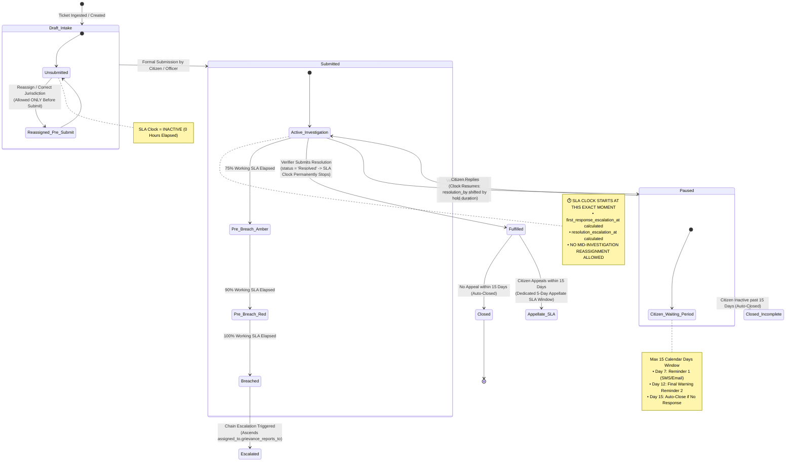
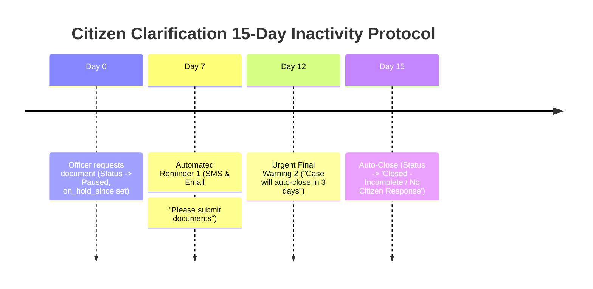
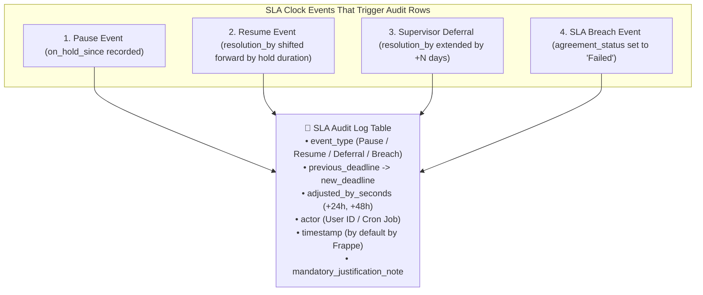
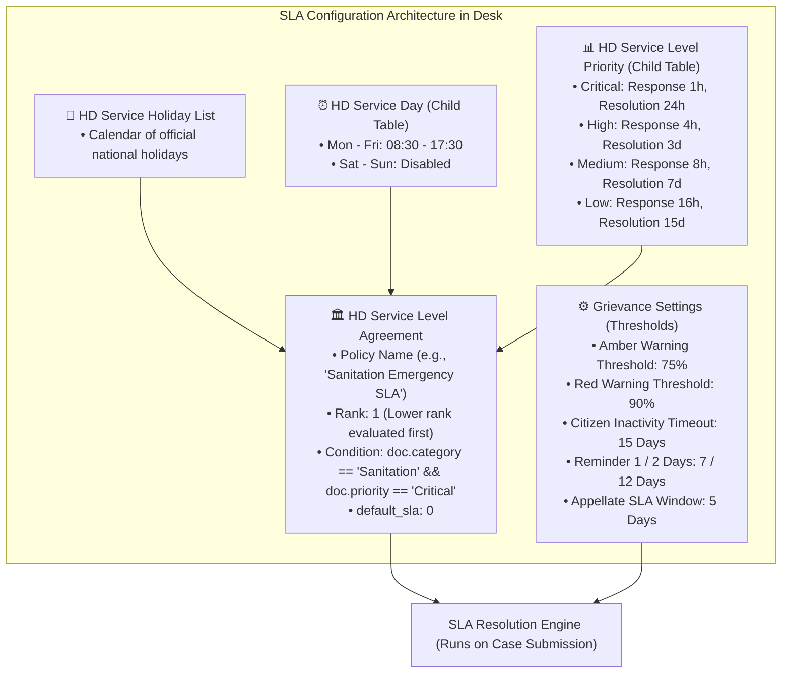

# SLA Workflows, Clock State Engine & Lifecycle Specification

This document provides the complete, end-to-end Service Level Agreement (SLA) operational specification for the **Grievance Redressal Service**, detailing clock mechanics, holiday and pause math, citizen response windows, pre-breach warning thresholds, and immutable SLA audit logging.

---

## 1. SLA Clock State Engine

The grievance SLA clock moves through distinct formal states driven purely by lifecycle events:



---

## 2. Mathematical Clock Mechanics (Holidays vs. Citizen Pause)

To ensure zero database bloat, the system **never polls or writes to the database every 5 minutes**. Time is evaluated through two distinct mathematical mechanisms:

```
┌─────────────────────────────────────────────────────────────────────────────────────────────┐
│ 1. HOLIDAYS & WEEKENDS: PRE-COMPUTED AT SUBMISSION (0 DB WRITES DURING HOLIDAYS)            │
│    • Working Hours: 08:30 - 17:30 (Mon-Fri) via HD Service Day                              │
│    • Official Holidays: Automatically skipped via HD Service Holiday List                   │
│    • Target generation: resolution_by = calculate_working_deadline(submitted_at, sla_hours) │
└─────────────────────────────────────────────────────────────────────────────────────────────┘

┌─────────────────────────────────────────────────────────────────────────────────────────────┐
│ 2. CITIZEN CLARIFICATION PAUSE: DYNAMICALLY SHIFTED ON RESUME (2 DB WRITES TOTAL)           │
│    • On Pause: Set on_hold_since = now(), status_category = 'Paused'                        │
│    • On Resume: Calculate hold_delta = working_hours(on_hold_since, now())                  │
│    • Shift Deadline: resolution_by = resolution_by + hold_delta                             │
│    • Update hold totals: total_hold_time += hold_delta, on_hold_since = NULL                │
└─────────────────────────────────────────────────────────────────────────────────────────────┘
```

---

## 3. Citizen Clarification Timeframe & Inactivity Protocol

To prevent tickets from sitting "On Hold" indefinitely when waiting for citizen documents, the system enforces a strict **15-Calendar-Day Response Window**:



### Inactivity Guard Rails

| Timeline Milestone         | Automated Action                                               | Notifications Triggered                               | System Outcome                                                                         |
| :------------------------- | :------------------------------------------------------------- | :---------------------------------------------------- | :------------------------------------------------------------------------------------- |
| **Day 0 (Pause Event)**    | Ticket enters`Paused` state.                                   | Instant SMS/Email to Citizen with upload link.        | SLA clock freezes at current working snapshot.                                         |
| **Day 7 (Reminder 1)**     | Background scheduler checks`now() - on_hold_since >= 7 days`.  | Polite reminder notification sent to citizen.         | Ticket remains paused.                                                                 |
| **Day 12 (Final Warning)** | Background scheduler checks`now() - on_hold_since >= 12 days`. | Urgent SMS/Email:_"Action required within 72 hours"_. | Ticket remains paused.                                                                 |
| **Day 15 (Auto-Closure)**  | Background scheduler checks`now() - on_hold_since >= 15 days`. | Closure notice sent to citizen.                       | Ticket status set to`Closed - Incomplete`. Verifier's open caseload capacity is freed. |

---

## 4. Category × Priority SLA Policy Matrix

Resolution and response targets evaluate strictly against active business hours:

| Priority Tier                 | Category Scope                                | First Response SLA   | Citizen Periodic Update | Target Resolution SLA |
| :---------------------------- | :-------------------------------------------- | :------------------- | :---------------------- | :-------------------- |
| **P1 - Critical / Emergency** | Severe Public Safety, Water Contamination     | **1 Working Hour**   | Every**12 Hours**       | **24 Working Hours**  |
| **P2 - High**                 | Service Disruption, Sanitation Hazard         | **4 Working Hours**  | Every**24 Hours**       | **3 Working Days**    |
| **P3 - Medium**               | Routine Administrative Delay, Billing Dispute | **8 Working Hours**  | Every**48 Hours**       | **7 Working Days**    |
| **P4 - Low**                  | General Feedback, Minor Policy Inquiry        | **16 Working Hours** | Every**72 Hours**       | **15 Working Days**   |

---

## 5. Pre-Breach Early Warnings ("Amber Alerts")

Scheduled background jobs evaluate SLA consumption and trigger early warnings before breaches occur:

- **75% SLA Elapsed (Amber Alert)**: Email & Desk alert sent to the assigned case officer (_"Case #1024 has consumed 75% of its SLA"_).
- **90% SLA Elapsed (Critical Red Alert)**: SMS and high-priority alert sent to both the case officer and their team supervisor.

---

## 6. Immutable SLA Audit Logging

Every change that alters the SLA clock state creates an immutable audit row in the case history:



---

## 7. Reassignment & Escalation Rules Summary

1. **Pre-Submit Only Reassignment**: Reassignment (changing `administrative_area`, `category`, or officer) is allowed **only before formal submission** (`Draft` stage), while the clock is inactive.
2. **Lock Upon Submission**: Once `Submitted`, the assigned officer owns the investigation. No lateral mid-investigation handoffs occur.
3. **Breach Escalation — follows the reporting chain, not the area tree**: If the officer fails to resolve within `resolution_by`, the case escalates to `assigned_to.grievance_reports_to` — the assignee's own supervisor — with a fresh escalation timer. Geography is respected by construction, because a supervisor's administrative area must be an ancestor of (or equal to) their officer's area. See §10.
4. **Vertical Only**: Escalation ascends the reporting chain and remand descends the same chain. There is no sideways move. A case misrouted to the wrong woreda after submission travels up to the common ancestor and back down, which costs extra hops but leaves a complete audit trail.
5. **Appellate Window**: Once `Resolved`, a 15-day objection period opens. If appealed, the case routes directly to the **Appellate Authority** with a dedicated **5-working-day** review SLA.

> **Why the chain and not `parent_administrative_area`:** ascending the area tree escalates to whoever happens to hold the parent area, which at national scale funnels every breach in a category to one desk and skips the person actually accountable for the case. The reporting chain names that person directly, and because supervisors are area-constrained it produces the same geographic movement without the bottleneck.

---

## 8. How to Configure SLAs, Ranking & Thresholds in Desk

Administrators configure, rank, and customize all SLA target times, matching conditions, and warning thresholds through declarative Frappe DocTypes:



### Configuration DocTypes & Fields Breakdown

| Configuration Area                | DocType Name                                | Key Configurable Fields                                                                                                                             | Purpose & Impact                                                                                                        |
| :-------------------------------- | :------------------------------------------ | :-------------------------------------------------------------------------------------------------------------------------------------------------- | :---------------------------------------------------------------------------------------------------------------------- |
| **SLA Policy Definition**         | `HD Service Level Agreement`                | •`service_level`: Policy Name• `enabled`: Active Toggle• `rank`: Evaluation Priority (Int)• `condition`: Python Expression• `default_sla`: Checkbox | Defines the matching rule. Lower rank policies are tested first; if no custom rule matches, falls back to`default_sla`. |
| **Working Hours Matrix**          | `HD Service Day` _(Child Table)_            | •`day`: Monday ... Sunday• `workday`: Checkbox• `start_time` / `end_time`: Time                                                                     | Defines official government operating hours. Timer pauses automatically outside these windows.                          |
| **Public Holiday Calendar**       | `HD Service Holiday List`                   | •`holiday_date`: Date• `description`: Holiday Name                                                                                                  | Registers national and regional non-working public holidays to skip during SLA calculation.                             |
| **Response / Resolution Targets** | `HD Service Level Priority` _(Child Table)_ | •`priority`: Critical / High / Med / Low• `response_time`: Duration• `resolution_time`: Duration                                                    | Specifies the exact target deadlines per priority level.                                                                |
| **Warning Thresholds & Timeouts** | `Grievance Settings` _(Single DocType)_     | •`amber_alert_percent`: 75%• `red_alert_percent`: 90%• `citizen_timeout_days`: 15• `appellate_sla_days`: 5                                          | Configures global early warning triggers, reminder dispatch intervals, and appellate deadlines.                         |

---

### Multi-SLA Match & Ranking Evaluation Flow

When a grievance is formally `Submitted`, Frappe resolves which SLA policy applies via this deterministic sequence:

1. **Query Active Policies**: System fetches all enabled `HD Service Level Agreement` records sorted by `rank ASC`.
2. **Evaluate Match Conditions**: System evaluates the `condition` field against the incoming case document (e.g. `doc.category == 'Water' and doc.administrative_area == 'Zone 1'`).
3. **First Match Wins**: The first policy whose condition evaluates to `True` is attached to `doc.sla`.
4. **Default Fallback**: If no specific condition matches, the system attaches the policy marked `default_sla = 1`.

---

## 9. Architectural Summary: Frappe Native vs Custom SLA Layer

```
┌─────────────────────────────────────────────────────────────────────────────────────────────┐
│                                CUSTOM GRIEVANCE SLA LAYER                                   │
│  • SLA Start Gate on Formal 'Submitted' Transition (Inactive in Draft)                      │
│  • 15-Day Citizen Clarification Protocol (Reminders on Day 7, 12; Auto-Close on Day 15)     │
│  • Pre-Breach Early Warnings (Amber Alerts at 75% & 90% SLA thresholds)                     │
│  • Dedicated 5-Working-Day Appellate Review SLA Window                                      │
│  • Immutable SLA Audit Log Table (Tracking all shifts, actors, and justifications)          │
│  • Reporting-Chain Escalation on Breach (assigned_to.grievance_reports_to, §10)             │
│  • Chain-Derived Approval Gates for Deferral & Reassignment (no seniority roles)            │
└──────────────────────────────────────────────┬──────────────────────────────────────────────┘
                                               │ Runs On Top Of
┌──────────────────────────────────────────────▼──────────────────────────────────────────────┐
│                                   BY DEFAULT BY FRAPPE                                      │
│  • Policy Definition & Rank Matching Engine (HD Service Level Agreement)                    │
│  • Working Hours Calculation & Daily Schedules (HD Service Day)                             │
│  • Public Holiday Exclusion Calendar (HD Service Holiday List)                              │
│  • Automated Hold-Time Tracking (on_hold_since, total_hold_time, status_category = 'Paused') │
│  • Database-level Optimistic Concurrency Control (modified timestamp)                       │
│  • Priority Matrix Target Resolution Calculation (HD Service Level Priority)                │
│  • Version Tracking & Field Diff Audit Trail (Version table & HD Ticket Activity)           │
└─────────────────────────────────────────────────────────────────────────────────────────────┘
```

---

## 10. Implementation Plan: Role Model & Reporting Chain

This section specifies **how** §7 rules 3 and 4 are built, and the role collapse that
makes them possible. It is the authoritative reference for the escalation, remand and
approval code paths.

### 10.1 The role model

The service runs on **three roles**, and only three. A role answers _what actions exist
for you_; it never answers _which cases you may touch_.

| Role                  | Held by                                                                                                              | Capability                                                                                             |
| :-------------------- | :------------------------------------------------------------------------------------------------------------------- | :----------------------------------------------------------------------------------------------------- |
| `Grievance Submitter` | Farmer, Development Agent, cooperative, FPO, NGO, woreda/kebele body — distinguished by`submitter_type`, not by role | File a grievance, track it, reply to a clarification request, confirm or reopen a resolution           |
| `Grievance Officer`   | Every case-working officer at every rung                                                                             | Read and work assigned cases, file structured responses, request deferrals, approve within their chain |
| `Grievance Admin`     | Platform administrator                                                                                               | Taxonomy, routing rules, SLA policy, holiday calendars, thresholds                                     |

**Seniority is not a role.** The former `L1 Nodal Officer`, `L2 Senior Nodal Officer`
and `Department Head` roles are replaced by position in the reporting chain. This is the
single change that keeps the role list at three no matter how many rungs the
organisation grows.

### 10.2 The reporting chain

A custom field on `User` supplies the chain:

| Field                  | Type        | Rule                                                                                                                                          |
| :--------------------- | :---------- | :-------------------------------------------------------------------------------------------------------------------------------------------- |
| `grievance_reports_to` | Link → User | The officer's supervisor. Validated on save: the supervisor's administrative area must be an**ancestor of, or equal to**, the officer's area. |

Implement the walk in a new module `oan_grievance_service/services/chain.py`:

```
ancestors(user, max_depth=8)
    Walk grievance_reports_to upward, nearest first.
    - Skip over disabled accounts rather than stopping, so a vacant post
      does not strand a breached case.
    - Stop on a repeated user, so a mis-configured cycle is harmless
      rather than infinite.
    - Cap at 8: the real chain is kebele -> woreda -> zone -> region ->
      national, so the cap is a guard, not a limit.

next_supervisor(user)   -> nearest enabled supervisor, or None at the top
is_ancestor(a, b)       -> True when a is somewhere above b
```

Cost is one indexed `get_value` per rung, bounded by depth. No recursive CTE, no tree
table, no denormalisation.

### 10.3 Escalation target resolution

Replace the target lookup in `services/sla.py::escalate` (currently `policy.top_level_authority`
for L2, department head otherwise) with a single ordered resolution:

| Order | Source                                           | Rationale                                                               |
| :---- | :----------------------------------------------- | :---------------------------------------------------------------------- |
| 1     | `next_supervisor(grievance.assigned_to)`         | The person actually accountable, in the right geography by construction |
| 2     | `Grievance Department.head_of_dept`              | Chain exhausted or the case is unassigned                               |
| 3     | `HD Service Level Agreement.top_level_authority` | Final backstop — a breached case must never have nobody to escalate to  |

The existing `Grievance Escalation Log`, `escalation_level`, `escalated` flag and breach
detection are unchanged. **Only target resolution moves.** That is what keeps this a
small, reversible change rather than a rewrite.

### 10.4 Remand

Remand is the strict inverse of escalation: the case returns to the officer it was taken
from, read from the most recent `Grievance Escalation Log` row. The person remanding must
satisfy `is_ancestor(session_user, target)`. This restriction is what prevents remand from
quietly becoming a general reassignment mechanism.

### 10.5 Approval gates without seniority roles

Both approval checks in `permissions.py` currently test for the `L2 Senior Nodal Officer`
role. Replace with a chain test:

| Gate                  | Current rule                          | Chain rule                                                                                                          |
| :-------------------- | :------------------------------------ | :------------------------------------------------------------------------------------------------------------------ |
| Reassignment approval | Caller holds`L2 Senior Nodal Officer` | Caller is an ancestor of the current assignee**and** of the target officer — i.e. a common supervisor of both       |
| SLA deferral approval | Caller holds`L2` or `Department Head` | Caller is an ancestor of the assignee. Self-approval only when`grievance_allow_self_deferral` is set in site config |

The chain rule is strictly more precise: "supervisor" means _this officer's_ supervisor,
which no role can express.

### 10.6 Work items

| #   | File                             | Change                                                                                                                                                                                                                                                                                        |
| :-- | :------------------------------- | :-------------------------------------------------------------------------------------------------------------------------------------------------------------------------------------------------------------------------------------------------------------------------------------------- |
| 1   | `setup/install.py`               | `ROLES` → the three roles of §10.1. Correct the module docstring, which still says "the six roles from Appendix F". Seed the `grievance_reports_to` custom field on User.                                                                                                                     |
| 2   | `hooks.py`                       | `fixtures` Role filter → the three roles                                                                                                                                                                                                                                                      |
| 3   | `permissions.py`                 | Replace the six`ROLE_*` constants; rewrite `grievance_query_conditions` and `has_grievance_permission` against the three roles; rewrite both `can_approve_*` per §10.5                                                                                                                        |
| 4   | `services/chain.py`              | **New.** The primitives in §10.2                                                                                                                                                                                                                                                              |
| 5   | `services/sla.py::escalate`      | Target resolution per §10.3                                                                                                                                                                                                                                                                   |
| 6   | `services/hooks_handlers.py`     | `reassignment_on_update` and `deferral_on_update` pass the document to the approval checks, whose signatures now take it; update the two `frappe.throw` messages, which name L2                                                                                                               |
| 7   | Doctype JSON`permissions`        | Remap across all 22 doctypes:`OAN Administrator-ATI`→Admin; `L1`/`L2`/`Department Head`→Officer; `Farmer`/`Assisted-Submissions`→Submitter. Drop `delete` from the Submitter grant on Grievance. Add Officer read on masters and logs — without it an officer cannot render a Grievance form. |
| 8   | `grievance_rbac_assignment.json` | `role` Select options → the three roles                                                                                                                                                                                                                                                       |
| 9   | `patches.txt`                    | Migration patch: create the three roles, map existing`Has Role` rows and `Grievance RBAC Assignment.role` values onto them, then delete the six obsolete roles                                                                                                                                |

### 10.7 Defects to fix in the same pass

- **`permissions.py` submitter write gate.** The branch reads
  `return ptype in ("read", "write") if doc.status else ptype == "read"`. `status` is
  always populated, so a submitter holds **write on their own grievance in every state**.
  It should permit write only when `status in (More Info Needed, Pending Submitter)` —
  the states that are actually awaiting them — and read otherwise.
- **`Submitter Profile` DocPerm.** Do **not** grant the `Grievance Submitter` role blanket
  read: there is no permission query condition on this doctype, so blanket read would
  expose every submitter's PII to every submitter. A submitter's own profile is served
  through the whitelisted API, not through Desk. Grant read to `Grievance Officer` only.
- **No CI guard.** Mirror the AST scanner in `oan_a2c/tests/test_bank_scope_enforcement.py`:
  fail the build on any `get_all` / `db.get_all` / `db.sql` against Grievance that lacks a
  scope filter. Neither `permission_query_conditions` nor `has_permission` fires on those
  calls, so this is where scoping leaks first appear.

### 10.8 Open decisions

1. ~~`desk_access` for `Grievance Submitter`~~ — **decided: no Desk access for any role.**
   All three roles are seeded with `desk_access = 0`. Every actor reaches the system
   through the portal and the v1 API, which keeps the secured surface to the whitelisted
   endpoints. Consequence to carry: assisted intake (call centre, front desk) must be
   served by those endpoints, not by a Desk intake screen, and officer case-working
   screens are `oan_grievance_ui`, not Desk. Re-enabling Desk later is one line per role
   but widens the surface to every doctype that role holds DocPerm on.
2. **Reassignment lives or dies.** §7 rules 1 and 2 state that reassignment happens only
   pre-submission, but the codebase carries a full `Grievance Reassignment Request`
   doctype, a `reassignment_on_update` handler and an approval gate. Decide before wiring
   §10.5: if reassignment is genuinely pre-submit only, the doctype, the handler and
   `can_approve_reassignment` are all removed and this section shrinks.
3. **Escalation timer on remand.** §7 rule 3 grants a fresh timer on escalation. Whether
   a remanded case resumes its original clock or receives a new window is unspecified.

### 10.9 Verification checklist

1. A fresh site installs and a user holding only `Grievance Officer` can open a Grievance
   form — proving the master-doctype read grants of work item 7 are complete.
2. A user with no `Grievance RBAC Assignment` sees zero grievances, not all of them
   (`grievance_query_conditions` returns `1 = 0`).
3. A submitter cannot write to their own grievance while it is `In Progress`.
4. Breach with a live supervisor escalates to that supervisor, not to `top_level_authority`.
5. Breach where the supervisor is disabled escalates past them to the next enabled rung.
6. Breach at the top of the chain falls through to `top_level_authority` — never to nobody.
7. A cycle in `grievance_reports_to` terminates the walk instead of hanging.
8. An officer cannot approve a deferral for a peer in a different branch of the chain.
