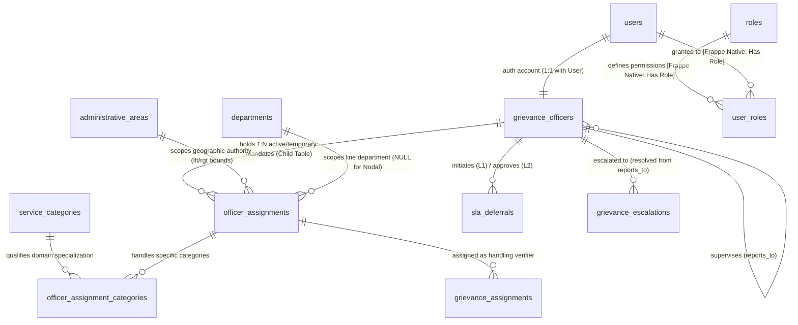
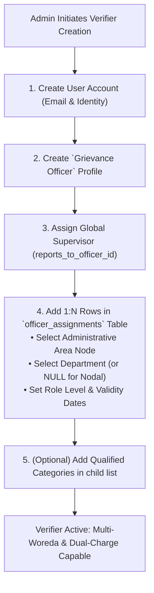
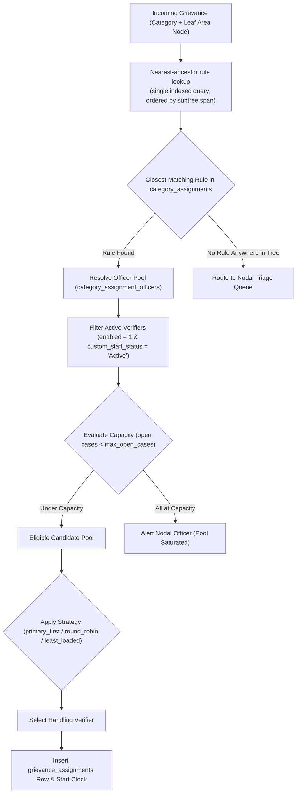
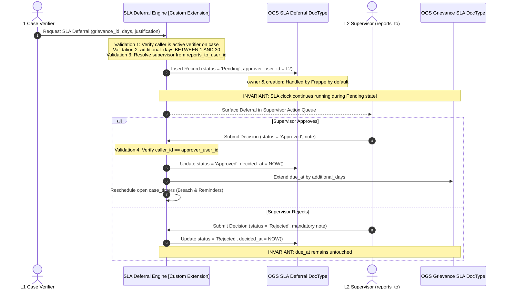
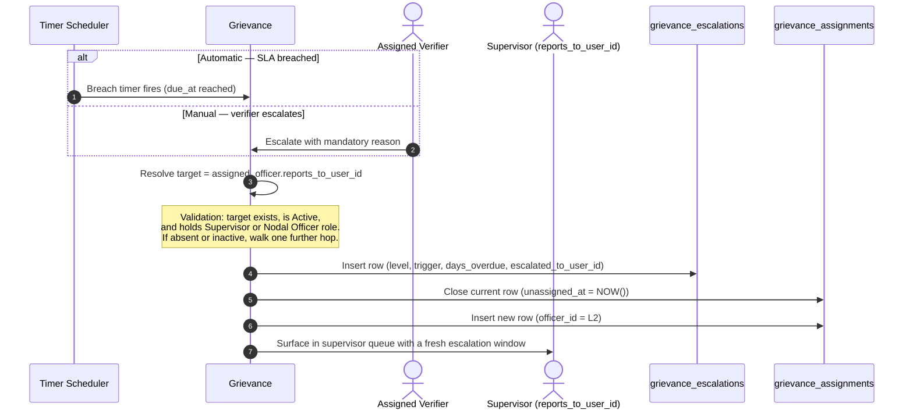

# Verifier Management: Schema, Creation Flows & Validation Matrix

This document defines the multi-country architecture, schema, creation flows and validation guard rails for **Verifiers (Case Officers, Supervisors and Nodal Officers)**, built on the administrative area tree specified in [`administrative_area_tree_implementation_plan.md`](./administrative_area_tree_implementation_plan.md). Column names and types follow [`database-schema.md`](./database-schema.md), which is the authority for the data model.

It also separates what the Frappe layer provides from what has to be built — the point of the exercise being to build only the second list.

---

## 1. Framework Native vs. Custom Implementation Summary

| Capability / Entity                                               |           Provided by Frappe?           | Details                                                                                                                                                                                                                                                                                                                                                                                                                                                                                                             |
| :---------------------------------------------------------------- | :-------------------------------------: | :------------------------------------------------------------------------------------------------------------------------------------------------------------------------------------------------------------------------------------------------------------------------------------------------------------------------------------------------------------------------------------------------------------------------------------------------------------------------------------------------------------------ |
| **Audit fields (`owner`, `creation`, `modified`, `modified_by`)** |               **Native**                | Maintained on every DocType.                                                                                                                                                                                                                                                                                                                                                                                                                                                                                        |
| **User account & auth (`email`, `phone`, `password`)**            |               **Native**                | `User` DocType, bcrypt hashing, session tokens, SSO/OAuth.                                                                                                                                                                                                                                                                                                                                                                                                                                                          |
| **Role assignment & RBAC matrix (`user_roles`)**                  |               **Native**                | `Role` and `Has Role` DocTypes plus the Role-Based Permission Manager.                                                                                                                                                                                                                                                                                                                                                                                                                                              |
| **Invitation & password setup flow**                              |               **Native**                | `User Invitation` / welcome email with a tokenised activation link.                                                                                                                                                                                                                                                                                                                                                                                                                                                 |
| **Optimistic concurrency control**                                |               **Native**                | `modified` timestamp guard on every save; stale writes raise `TimestampMismatchError`.                                                                                                                                                                                                                                                                                                                                                                                                                              |
| **Hierarchical tree indexes (`lft`, `rgt`)**                      |        **Native, with a caveat**        | The `NestedSet` engine maintains the interval indexes. It assumes a single root — hence the synthetic World node.                                                                                                                                                                                                                                                                                                                                                                                                   |
| **Sub-tree scoping queries**                                      | **Custom — do not assume this is free** | Scope comes from `administrative_area_id` on the officer's profile record, applied as the interval predicate `g.area_lft > :officer_lft AND g.area_lft < :officer_rgt`. That needs a `permission_query_conditions` hook, a `has_permission` hook, `area_lft` on `grievances`, and a CI guard on `get_all`. Frappe's native `User Permission` cannot express a range — it materialises the full descendant list and inlines it as an `IN (...)` — so none of this comes for free. Specified in the tree document §6. |
| **Verifier area link (`administrative_area_id`)**                 |               **Custom**                | Link from the officer record to the assigned tree node.                                                                                                                                                                                                                                                                                                                                                                                                                                                             |
| **Operational roles**                                             |               **Native**                | `Case Officer`, `Supervisor`, `Nodal Officer` assigned through `Has Role`.                                                                                                                                                                                                                                                                                                                                                                                                                                          |
| **Supervisor relationship (`reports_to_user_id`)**                |               **Custom**                | Self-referencing link on the officer record. Authoritative for escalation.                                                                                                                                                                                                                                                                                                                                                                                                                                          |
| **Domain routing pools (`category_assignment_officers`)**         |               **Custom**                | Child table defining tier-2 officer rotation.                                                                                                                                                                                                                                                                                                                                                                                                                                                                       |
| **SLA deferral approvals (`sla_deferrals`)**                      |               **Custom**                | The only supervisor approval workflow on a live case.                                                                                                                                                                                                                                                                                                                                                                                                                                                               |

> Fields marked custom appear in `database-schema.md` under their bare names (`reports_to_user_id`); in the Frappe layer they carry the `custom_` prefix that custom fields on a stock DocType require (`custom_reports_to_user_id`). Same column, two spellings.

---

### 2. Generic Verifier Entity Relationship Diagram (ERD)

---

## 3. Verifier Schema Specifications

### `administrative_areas`

Specified in full in [`administrative_area_tree_implementation_plan.md`](./administrative_area_tree_implementation_plan.md) §3. One tree under a synthetic World root, each country a child of it; arbitrary tiers, effective-dated. The columns this document relies on are `id`, `parent_id`, `is_group`, `valid_to`, `lft` and `rgt`.

---

### `grievance_officers` (Custom Master DocType)

Stores the officer's core profile, global availability status, and supervisor chain. 1:1 with Frappe's native `User`.

#### Fields:

- `id` (`uuid`, **PK**): Primary key.
- `user` (`Link → User`, **UQ**): Bound Frappe login account.
- `full_name` (`text`): Officer's full name.
- `email` (`citext`, **UQ**): Official contact email.
- `phone` (`varchar(24)`): Official phone number.
- `job_title` (`text`): Display designation.
- `reports_to_officer_id` (`uuid`, **FK → grievance_officers.id**, _Nullable_): Direct supervisor for escalation and approval workflows.
- `staff_status` (`enum: staff_status`, **IX**): `Active`, `Inactive`, `On Leave`. If `On Leave`, all active assignments pause globally.
- `max_open_cases` (`int`, _Nullable_): Caseload capacity ceiling.
- `open_case_count` (`int`): Maintained counter of live active assignments.
- `is_active` (`boolean`): Active toggle (`1 = Active, 0 = Inactive`).

---

### `officer_assignments` (1:N Child Table inside `grievance_officers`)

Models the officer's geographic jurisdiction, line department, domain specialization, and temporary appointments.

#### Fields:

- `id` (`uuid`, **PK**): Assignment ID.
- `officer_id` (`uuid`, **FK → grievance_officers.id**, **IX**): Parent officer.
- `administrative_area_id` (`uuid`, **FK → administrative_areas.id**, **IX**): Scopes geographic visibility. Setting it to a woreda grants that woreda; setting it to a region grants the entire region.
- `area_lft` / `area_rgt` (`int`): Subtree interval bounds copied from the referenced area.
- `department_id` (`uuid`, **FK → departments.id**, _Nullable_): Line department for Case Officers. **Must be NULL for Nodal officers**, who oversee all departments across their area.
- ~~`role_level` (`enum`): `l1_case_officer`, `l2_supervisor`, `nodal_officer`, `department_head`.~~ **Superseded** — now a Link to the `Grievance Role Level` master, seeded with three rungs (`nodal_officer`, `senior_nodal_officer`, `department_head`). `l1_case_officer` and `l2_supervisor` were never rungs of this organisation; see `sla_workflows_and_lifecycle_specification.md` §10.1 and `database-schema.md` §`grievance_role_levels`.
- `is_primary` (`boolean`): `1` for permanent post, `0` for acting/temporary charge.
- `valid_from` (`date`): Activation start date.
- `valid_to` (`date`, _Nullable_): Expiration date. `NULL` indicates indefinite assignment.
- `is_active` (`boolean`): Active toggle.

---

### `officer_assignment_categories` (Child Table inside `officer_assignments`)

Specialized category bindings for an assignment. If empty, the officer handles **all categories** within their department and jurisdiction.

- `id` (`uuid`, **PK**): ID.
- `assignment_id` (`uuid`, **FK → officer_assignments.id**): Parent assignment.
- `category_id` (`uuid`, **FK → service_categories.id**): Qualified service category.

---

## 4. Generic Verifier Creation & Management Flows

### Flow 1: Generic Verifier Onboarding & Assignment Scoping

#### Step-by-Step Creation Sequence & Validations

| Step                         | Target Table                    | Generic Validation & Guard Rail                                                                                                  |
| :--------------------------- | :------------------------------ | :------------------------------------------------------------------------------------------------------------------------------- |
| **1. Identity & Auth**       | `User`                          | Standard Frappe user account with unique email and login credentials.                                                            |
| **2. Officer Profile**       | `grievance_officers`            | Sets global `staff_status` (`Active`), `max_open_cases`, and links to `User`.                                                    |
| **3. Supervisor Link**       | `grievance_officers`            | `reports_to_officer_id` must be an active supervisor whose jurisdiction is an ancestor of or equal to the officer's area.        |
| **4. Primary Assignment**    | `officer_assignments`           | Every officer must have at least one primary assignment (`is_primary = 1`). `department_id` is mandatory for L1, NULL for Nodal. |
| **5. Temporary Assignments** | `officer_assignments`           | Additional rows created for dual charge or acting coverage with explicit `valid_to` dates.                                       |
| **6. Category Scope**        | `officer_assignment_categories` | Defines specialized categories or left empty for generalist coverage.                                                            |

---

### Flow 2: Case Allocation & Universal Sub-Tree Routing

#### Step-by-Step Creation Sequence & Validations

| Step                  | Target Table            | Validation & Guard Rail                                                                                       | Mechanism                                                                                                                      |
| :-------------------- | :---------------------- | :------------------------------------------------------------------------------------------------------------ | :----------------------------------------------------------------------------------------------------------------------------- |
| **1. Ancestor Match** | `category_assignments`  | Resolves the closest rule at or above the incident's leaf area, in one indexed query ordered by subtree span. | **[Custom]** interval containment on `(lft, rgt)`.                                                                             |
| **2. Active Filter**  | `users`                 | Verifier must have `staff_status = 'Active'`.                                                                 | **[Custom]** — the single availability flag.                                                                                   |
| **3. Caseload Cap**   | `users`                 | `open_case_count < max_open_cases`, read from the maintained counter.                                         | **[Custom]** prevents staff overload without a per-candidate `COUNT(*)`.                                                       |
| **4. Single Owner**   | `grievance_assignments` | At most one live assignment per grievance.                                                                    | **[Custom]** partial unique index: `UNIQUE (grievance_id) WHERE unassigned_at IS NULL`. Specified in `database-schema.md` §6b. |

**Routing runs asynchronously.** The grievance is persisted and acknowledged to the submitter first; routing is an enqueued job. The FSD's 10-second submission ceiling is not a budget to spend on rule resolution, pool filtering and counter updates, and a routing failure must never cost a citizen their submission. Until routing completes the case sits in the nodal triage queue, which is where it would land on failure anyway.

---

### Flow 3: Generic Verifier-to-Supervisor SLA Deferral Workflow

---

### Flow 4: Escalation Along the Reporting Chain

There is **no lateral reassignment of a live case**. Once a grievance is submitted the assigned verifier owns it, and the only way it changes hands is vertically, along `reports_to_user_id`. See §5 and the lifecycle specification §7.

**Why the reporting chain and not the area tree.** Both were candidates. The reporting chain wins because it is the one an administrator can actually set: it is data on the officer record, it is corrected the day an org chart changes, and it handles the cases geography cannot — a woreda whose supervisor sits in a different zone, a department whose chain runs to a line ministry rather than to the local administration, a vacancy covered from elsewhere.

The area tree is not discarded; it constrains the chain. The onboarding validation in Flow 1 step 6 requires a supervisor's area to be an ancestor of, or equal to, the subordinate's. So the reporting chain _does_ ascend the geography — because it was provisioned to — while remaining free to skip a level or cross a branch where the org chart really does. Geography defines what is legal; the chain defines what happens.

---

## 5. Summary of Invariants

1. **Sub-Tree Visibility**: Data visibility is interval containment — `g.area_lft > officer.area_lft AND g.area_lft < officer.area_rgt` — one indexed range predicate on one column, independent of subtree size, with no per-country code.
2. **Nearest-Ancestor Rule Resolution**: Routing rules match the closest administrative area at or above the incident, resolved in one query ordered by subtree span.
3. **Hierarchy Integrity**: Every field officer has a `reports_to_user_id` holding the Supervisor or Nodal Officer role, and that supervisor's area is an ancestor of or equal to the officer's.
4. **Escalation Is Vertical Only**: A live case moves only along `reports_to_user_id`. There is no lateral handoff, so there is no reassignment approval workflow and no `sla_treatment` decision to make.
5. **Jurisdiction Is Corrected Before Submission**: Wrong area or wrong department is fixed while the case is in draft, when the SLA clock has not started. After submission the routing is final.
6. **Nodal Multi-Department Scope**: Nodal officers hold `department_id = NULL` to oversee all line departments within their jurisdiction.
7. **Caseload Protection**: Routing never assigns beyond `max_open_cases`, compared against the maintained `open_case_count`.
8. **SLA Non-Interruption**: A pending deferral never pauses or resets the clock. Only an approved one moves `due_at`.
9. **Single Live Assignment**: `UNIQUE (grievance_id) WHERE unassigned_at IS NULL` — enforced by the database, not by the application.
