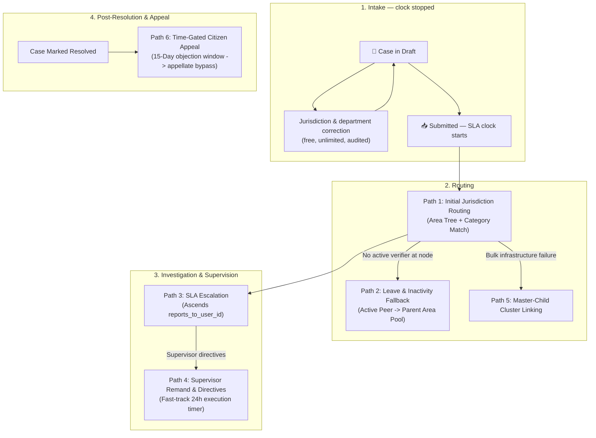
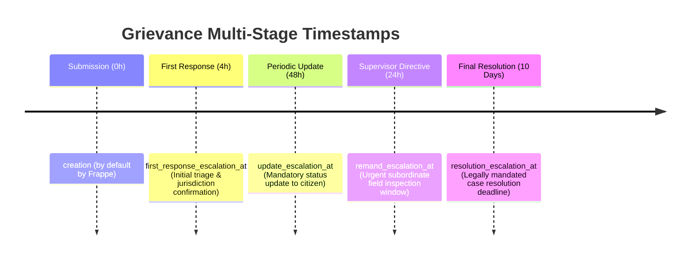
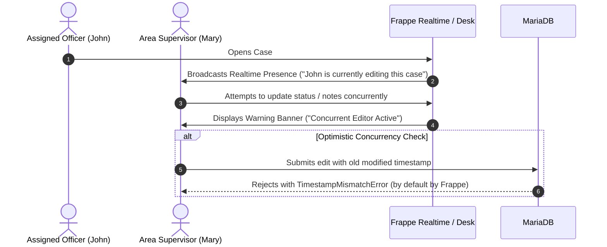
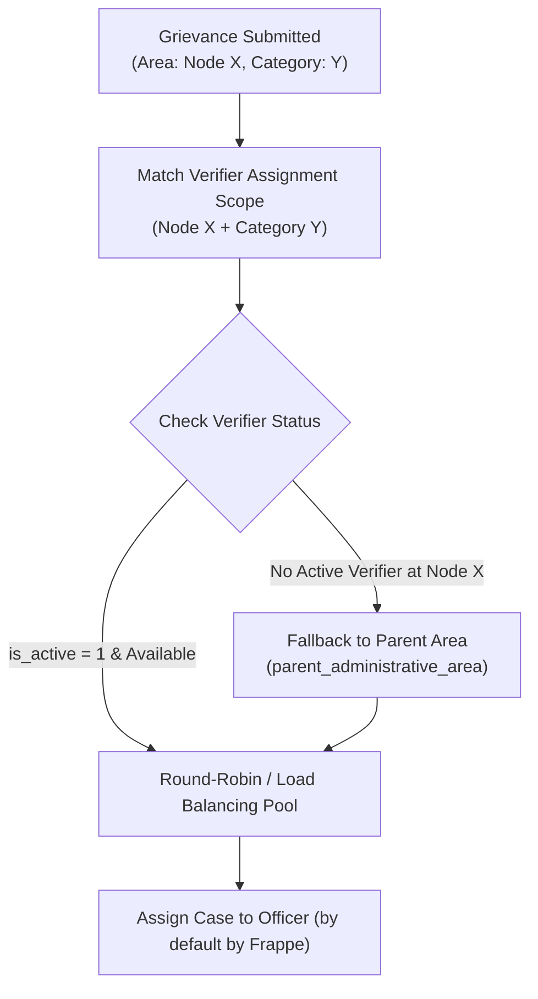
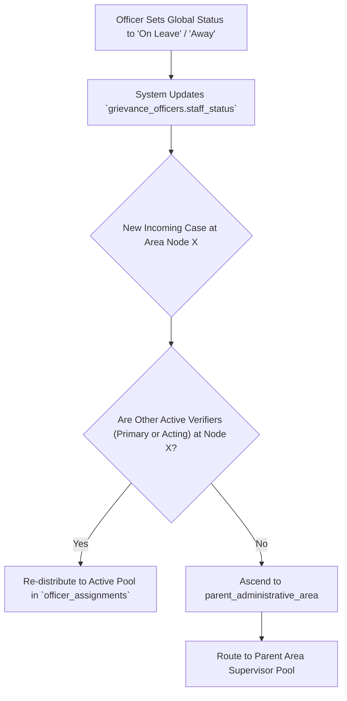
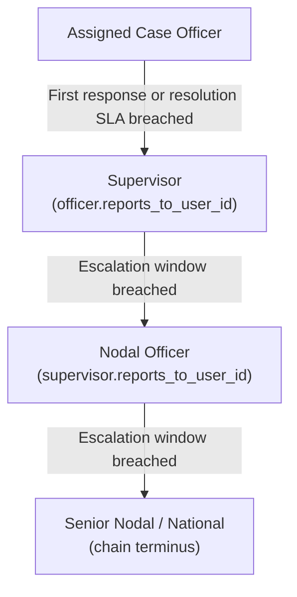
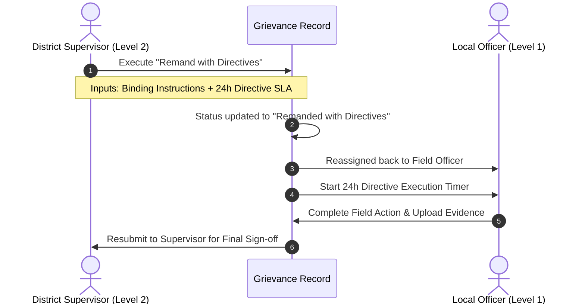
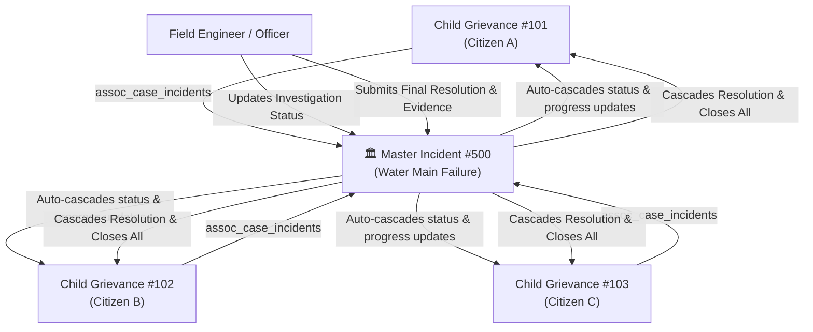
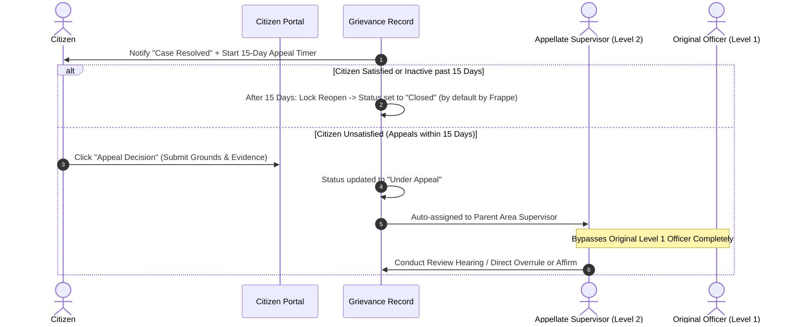

# Routing, Assignment & Escalation Paths

This document defines the operational path architecture for the **Grievance Redressal Service**, drawing on **DIGIT eGov PGR**, **Netflix Dispatch**, **Zammad** and **Frappe Helpdesk**. Column names follow [`database-schema.md`](./database-schema.md); the geography model is specified in [`administrative_area_tree_implementation_plan.md`](./administrative_area_tree_implementation_plan.md).

**The governing rule.** A submitted case does not move sideways. Jurisdiction and department are settled before submission, while the SLA clock is stopped; after submission the assigned verifier owns the case, and it changes hands only by ascending the reporting chain. Every path below is a consequence of that rule, and the paths a lateral-handoff design would need — reassignment requests, transfer approvals, `sla_treatment` — do not exist here.

---

## 1. Master Routing & Path Architecture Map



---

## 2. Multi-Stage Milestone & Escalation Timestamps

Rather than relying on a single due date, each grievance tracks independent lifecycle timestamps to identify exact pipeline bottlenecks and support multi-tier escalations:



| Milestone Timestamp         | Field Name          | Purpose                                                                        | How it fires                                                                 |
| :-------------------------- | :------------------ | :----------------------------------------------------------------------------- | :--------------------------------------------------------------------------- |
| **First Response Due**      | `first_response_at` | Deadline for the local officer to open the case and send a first response.     | Computed from the matched `sla_policies` row at submission.                  |
| **Periodic Update Due**     | `update_due_at`     | Prevents stalled cases by requiring a verifier update on the policy's cadence. | Recomputed on each public update.                                            |
| **Directive Execution Due** | `remand_due_at`     | Fast-track timer for officers executing a supervisor's remand order.           | Set on the remand action.                                                    |
| **Resolution Due**          | `due_at`            | Final resolution deadline, in working hours.                                   | Computed from `sla_policies` and the `business_calendars` row at submission. |
| **Appeal Window Expiry**    | `appeal_expiry_at`  | Objection period after resolution, before the case auto-closes.                | Computed on transition to Resolved.                                          |

**Every one of these is backed by a `case_timers` row, not by a scan.** Each deadline — and each pre-breach warning and citizen reminder derived from it — is written as a row with a `fire_at` when the deadline is computed. The scheduler reads `WHERE fire_at <= now() AND status = 'pending'` with `FOR UPDATE SKIP LOCKED` and does nothing else. It never sweeps the grievance table asking which cases are late, because at national volume that scan is the outage. This is the mechanism specified in `database-schema.md` §10; nothing in this document introduces a second clock.

---

## 3. Concurrency & Officer Collision Prevention

In high-volume public administration, collisions occur when supervisors, call center receptionists, or peer officers view or edit an already assigned ticket simultaneously.



- **Optimistic Database Locking (`by default by Frappe`)**: MariaDB validates the `modified` timestamp on document save. If another user modified the record in the interim, Frappe rejects the stale write with a `TimestampMismatchError`.
- **Real-time Live Presence**: Visual lock indicators on desk forms prevent accidental duplicate phone calls or conflicting citizen updates.

---

## 4. Detailed Operational Path Specifications

---

### Path 1: Initial Jurisdiction Routing Path

- **Source Systems**: **DIGIT eGov PGR**, **Frappe Helpdesk**
- **Purpose**: Auto-route new grievances to active local officers based on the `Administrative Area` Nested Set tree and grievance category.



#### Step-by-Step Logic & Validations

1. **Jurisdiction Filter**: Resolve the nearest `category_assignments` rule at or above the incident's leaf area — one indexed query ordered by subtree span, not a level-by-level climb.
2. **Officer Pool Resolution**: Query `officer_assignments` matching the resolved `department_id` and overlapping the incident area's tree interval (`area_lft <= incident_lft AND area_rgt >= incident_rgt`), checking that `NOW() BETWEEN valid_from AND COALESCE(valid_to, '9999-12-31')` and `is_active = 1`.
3. **Presence & Availability Verification**: Filter candidate assignments to officers whose parent `grievance_officers.staff_status = 'Active'`.
4. **Load Balancing & Primary Preference**: Prioritize primary assignments (`is_primary = 1`), falling back to active temporary/acting assignments (`is_primary = 0`). Distribute by `routing_strategy`, comparing `open_case_count` against `max_open_cases`.
5. **SLA Initialisation**: Compute `due_at` and the milestone deadlines from the matched policy and calendar, and write the `case_timers` rows that will fire them.
6. **Asynchronous**: All of the above runs in an enqueued job after the submission is persisted and acknowledged. The submitter's request does not wait on routing, and a routing failure leaves the case in the nodal triage queue rather than losing it.

#### Before submission: jurisdiction correction

While a case is in draft, its area, category and department are freely correctable by the intake officer — no approval, no limit, no SLA consequence, because the clock has not started. Each correction is an ordinary audited change, captured by `audit_log` and, once an assignment exists, by the `grievance_assignments` history. There is no separate request-and-approve workflow, because there is nothing to approve: no citizen is waiting on a clock and no officer has been made to own work they cannot do.

This is the design's answer to misrouting, and it is why nothing downstream needs a lateral transfer. It also places the burden correctly — getting jurisdiction right is intake's job, and doing it at intake costs one form change instead of a two-party approval on a running clock.

---

### Path 2: Verifier Leave & Inactivity Fallback Path

- **Source Systems**: **Frappe Helpdesk**, **Zammad**, **DIGIT eGov PGR**
- **Purpose**: Automatically bypass absent or on-leave officers and route to active acting officers (`is_primary = 0`) or upward supervisors.



#### Step-by-Step Logic & Validations

1. **Status Trigger**: Officer's parent record `grievance_officers.staff_status` is set to `On Leave` or `Inactive`.
2. **Auto-Exclusion**: All their child `officer_assignments` immediately stop appearing in candidate pools for _new_ routing.
3. **Two-Tier Fallback** — both evaluated at routing time, before an owner exists:
   - _Tier 1 (Peer & Acting Fallback)_: Prefer remaining active primary officers or temporary acting officers (`is_primary = 0`) covering that woreda.
   - _Tier 2 (Upward Fallback)_: If none, resolve the pool at the parent area node in the tree.
4. **Cases already assigned do not move.** Leave is not a transfer trigger. The case stays with its owner and, if it goes late, ascends the reporting chain by Path 3 like any other late case — which is the same supervisor who would have picked it up, reached by a mechanism that is auditable and already exists. A leave-triggered lateral sweep would be a second way to move cases, differing from Path 3 only in leaving no breach record.

> This path acts on the routing decision, not on ownership. That is what keeps it compatible with the no-lateral-movement rule.

---

### Path 3: SLA Escalation Path (Reporting Chain)

- **Source Systems**: **DIGIT eGov PGR**, **Zammad**, **Frappe Helpdesk**
- **Purpose**: Escalate unresolved cases to the responsible supervisor when SLA thresholds breach.



#### Why the reporting chain rather than the area tree

Both hierarchies exist and they usually agree. The chain is authoritative because it is the one that can be _maintained_: `reports_to_user_id` is a field an administrator updates the day the org chart changes, whereas deriving a supervisor from the area tree means the system infers authority from geography and is wrong every time the two diverge — a department reporting to a line ministry rather than the local administration, a vacancy covered from a neighbouring zone, a specialist unit spanning several woredas.

The tree is not abandoned; it constrains the chain. Onboarding requires a supervisor's area to be an ancestor of or equal to the subordinate's, so a correctly provisioned chain ascends the geography by construction. Geography defines the legal shape of the hierarchy; the chain defines who actually receives the case.

This also matches `database-schema.md`, where `grievance_escalations.escalated_to_user_id` is already specified as "resolved from `reports_to_user_id`".

#### Step-by-Step Logic & Validations

1. **Escalation Triggers**:
   - **Automatic**: A `case_timers` breach row fires. No table scan for late cases.
   - **Manual**: The assigned officer escalates with a mandatory justification.
2. **Target Resolution**: `escalated_to_user_id = assigned_officer.reports_to_user_id`.
3. **Chain Repair**: If the target is missing, `Inactive`, or `On Leave`, walk one further hop up the chain. A chain that reaches a null before reaching an active officer is a provisioning defect, not a runtime condition — it raises an alert and the case goes to the national queue rather than being silently dropped.
4. **Loop Guard**: The walk is bounded, and onboarding rejects any `reports_to_user_id` that would close a cycle. An unbounded walk over a mis-provisioned chain is an infinite loop in a background job.
5. **Reassignment**: Close the current `grievance_assignments` row, open one for the supervisor. The partial unique index guarantees there is never more than one live.
6. **Escalation Window**: Start a dedicated escalation SLA with its own `case_timers` row. The original `due_at` is untouched — it has already been breached, and overwriting it would erase the breach from the compliance figures.
7. **Timeline Logging**: An `Escalated` entry recording previous assignee, new supervisor, trigger and reason.

---

### Path 4: Supervisor Remand & Directives Path

- **Source Systems**: **DIGIT eGov PGR**, **Netflix Dispatch**
- **Purpose**: Enable supervisors to return escalated cases to subordinate officers with binding field instructions and fast-track timers.



#### Step-by-Step Logic & Validations

1. **Remand Eligibility**: Only a supervisor currently holding an escalated case can remand it, and only back down the same chain it came up — to the officer it was escalated from. A remand is the inverse of Path 3, not a general assignment power; without that restriction it becomes lateral reassignment wearing a different name.
2. **Mandatory Directives**: Explicit written instructions (`remand_directives`) detailing the required field actions.
3. **Fast-Track SLA**: A strict, non-pausable execution timer (`remand_due_at`, default 24 hours), backed by its own `case_timers` row.
4. **Subordinate Execution**: The officer carries out the directive and returns the case to the supervisor for sign-off. Accountability stays with the supervisor throughout — the remand delegates the work, not the ownership.

---

### Path 5: Master-Child Cluster Linking Path

- **Source Systems**: **Netflix Dispatch** (`assoc_case_incidents`), **Zammad**
- **Purpose**: Link multiple localized citizen complaints (e.g. 50 complaints about a broken water pipeline) to one Master Incident for synchronized investigation and bulk resolution.



#### Step-by-Step Logic & Validations

1. **Association Linkage**: Individual grievances set `is_child_incident = 1` and link to `master_incident` via a Many-to-Many association table.
2. **Action Cascading**:
   - Status changes on the Master Incident automatically update all linked child cases.
   - Progress notes posted on the Master Incident trigger citizen SMS/Email broadcasts `(by default by Frappe)`.
3. **Resolution Broadcast**: Marking the Master Incident as `Resolved` with evidence automatically resolves and closes all linked child cases.

---

### Path 6: Time-Gated Citizen Appeal & Reopen Path

- **Source Systems**: **DIGIT eGov PGR**, **Zammad** (`ChecksReopenAfterCertainTime`)
- **Purpose**: Provide a legally mandated 15-day appeal window that routes contested resolutions directly to an independent appellate supervisor.



#### Step-by-Step Logic & Validations

1. **15-Day Time Gate**: The appeal option is active only while `now() <= appeal_expiry_at` (15 calendar days from resolution). Once expired, the reopen action is locked permanently.
2. **Appellate Bypass**: The appeal **must not** return to the original case officer. It routes strictly to the `parent_administrative_area` supervisor.
3. **Appellate Powers**: The supervisor can affirm the closure or issue a binding overrule order to the local department.

---

## 5. Architectural Separation: Native Frappe vs Custom Grievance Layer

```
┌─────────────────────────────────────────────────────────────────────────────────────────────┐
│                                  CUSTOM GRIEVANCE LAYER                                     │
│  • Administrative Area Tree Traversal (Path 1, Path 4)                                     │
│  • Reassignment Request & Supervisor Transfer Approval (Path 2)                             │
│  • Two-Tier Leave Fallback Engine (Peer -> Parent Area) (Path 3)                           │
│  • Supervisor Remand Directives with Fast-Track Timers (Path 5)                             │
│  • Master-Child Cluster Linking & Cascading Actions (Path 6)                               │
│  • 15-Day Citizen Appeal & Appellate Bypass Routing (Path 7)                               │
│  • Multi-Stage Milestone Timestamps (First Response, Update, Remand, Resolution)            │
└──────────────────────────────────────────────┬──────────────────────────────────────────────┘
                                               │ Runs On Top Of
┌──────────────────────────────────────────────▼──────────────────────────────────────────────┐
│                                   BY DEFAULT BY FRAPPE                                      │
│  • Dynamic Assignment Rules (Round-Robin & Weighted Distribution)                           │
│  • Agent Presence & Availability State Tracking (is_active, availability)                   │
│  • Working-Hours SLA Engine (Holiday lists, resolution timers, pause states)                │
│  • Nested Set Indexing (lft, rgt, parent_tree)                                              │
│  • Optimistic Concurrency Locking (TimestampMismatchError on modified column)               │
│  • Activity Logs & Version Audit Trail (modified, modified_by, timeline)                    │
│  • User Permissions & Match Rules (Role-based access control)                               │
│  • Multi-channel Notifications & Email/SMS Alerts                                           │
└─────────────────────────────────────────────────────────────────────────────────────────────┘
```
