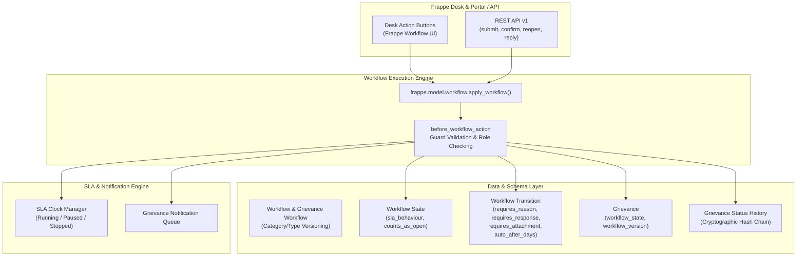
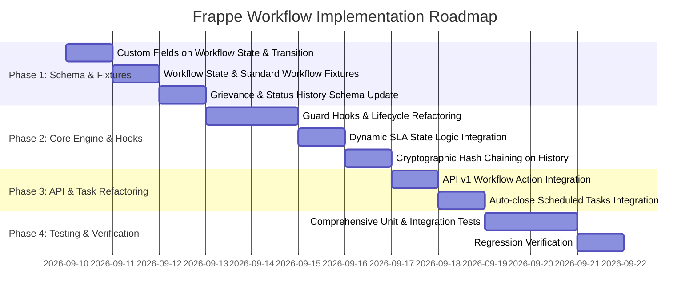

# Implementation Plan: Frappe-Native Dynamic Workflow Architecture

## Executive Summary

This plan outlines the end-to-end migration from the current static Python-based status machine to a **dynamic, Frappe-native Workflow engine** that fulfills the schema and regulatory specifications in [`.docs/database-schema.md`](file:///Users/arnav/Code/frappe_local/frappe-bench/apps/oan_grievance_service/.docs/database-schema.md) and [`.docs/database_to_doctype_field_mapping.md`](file:///Users/arnav/Code/frappe_local/frappe-bench/apps/oan_grievance_service/.docs/database_to_doctype_field_mapping.md).



---

## 1. Schema & DocType Enhancements

### 1.1 Extend `Workflow State` (Native Frappe DocType)

Add custom fields via `custom_field.json` / fixtures:

- `state_code` (`Data`, Unique): Machine key (e.g. `submitted`, `in_progress`, `pending_submitter`).
- `sla_behaviour` (`Select`: `running`, `paused`, `stopped`): Controls SLA clock execution in this state.
- `counts_as_open` (`Check`, default 1): For backlog and active case reporting.
- `is_terminal` (`Check`, default 0): True for terminal outcomes (`Closed`, `Rejected`).
- `requires_assignment` (`Check`, default 0): Blocks entry if no officer is assigned.
- `sort_order` (`Int`): Pipeline stepper display ordering.

### 1.2 Extend `Workflow Transition` (Native Frappe Child DocType)

Add custom fields to the transition table:

- `requires_reason` (`Check`, default 0): Enforces mandatory explanation on reject or reopen.
- `requires_response` (`Check`, default 0): Blocks transition until a `Grievance Response` is recorded.
- `requires_attachment` (`Check`, default 0): Blocks transition until supporting evidence is attached.
- `auto_after_days` (`Int`): Auto-transition trigger window (e.g. 7-day auto-closure).
- `notification_config` (`Link` $\rightarrow$ `Grievance Notification Config`): Automatic event dispatch.

### 1.3 `Grievance Workflow` (Custom DocType for Versioning & Master Binding)

To deliver Deliverable 1's requirement for category/type dynamic binding and immutable version pinning:

- Fields: `workflow_key` (`Data`), `version` (`Int`), `workflow_name` (`Data`), `service_category` (`Link` $\rightarrow$ `Service Category`), `grievance_type` (`Link` $\rightarrow$ `Grievance Type`), `is_current` (`Check`), `published_at` (`Datetime`), `retired_at` (`Datetime`).
- Logic: Automatically creates and syncs the corresponding Frappe `Workflow` definition when published.

### 1.4 Update `Grievance` DocType

- Add `workflow_state` (`Link` $\rightarrow$ `Workflow State`, mandatory) as Frappe's `workflow_state_field`.
- Maintain `status` as a virtual or synced field for API backward compatibility.
- Add `workflow_version` (`Link` $\rightarrow$ `Grievance Workflow` / `Workflow`).

### 1.5 Update `Grievance Status History` DocType

- `from_status` (`Link` $\rightarrow$ `Workflow State`).
- `to_status` (`Link` $\rightarrow$ `Workflow State`, mandatory).
- `transition` (`Link` $\rightarrow$ `Workflow Transition` or `Grievance Workflow Transition`).
- `reason` (`Small Text`): Structured explanation.
- `closure_type` (`Select`: `confirmed`, `auto_closed`, `rejected`, `referred`).
- `changed_by` (`Link` $\rightarrow$ `User`, mandatory).
- `is_automated` (`Check`).
- `prev_hash` (`Data`): SHA-256 hash of previous history record for this case.
- `row_hash` (`Data`): SHA-256 hash of current entry (`grievance + from + to + timestamp + changed_by + prev_hash`).

---

## 2. Transition Guard & Lifecycle Hook Implementation

### 2.1 Workflow Guard Enforcement (`before_workflow_action` & `validate`)

Implement centralized guard validation in [hooks_handlers.py](file:///Users/arnav/Code/frappe_local/frappe-bench/apps/oan_grievance_service/oan_grievance_service/services/hooks_handlers.py):

1. **Response Check**: Verify at least one `Grievance Response` exists before allowing moves to `Pending Submitter` / `Resolved`.
2. **Reason Check**: Require `reason` parameter before allowing moves to `Rejected` or `In Progress` (reopen).
3. **Assignment Check**: Ensure `assigned_to` or `assigned_dept` is set if target state has `requires_assignment = 1`.
4. **Evidence Check**: Ensure `max_attachments > 0` or files exist if `requires_attachment = 1`.

### 2.2 Dynamic SLA State Handling (`Workflow State.sla_behaviour`)

Refactor [sla.py](file:///Users/arnav/Code/frappe_local/frappe-bench/apps/oan_grievance_service/oan_grievance_service/services/sla.py) and [lifecycle.py](file:///Users/arnav/Code/frappe_local/frappe-bench/apps/oan_grievance_service/oan_grievance_service/services/lifecycle.py):

- **`running`**: If `sla_start_at` is empty, start SLA clock (e.g. on `Assigned`). If clock was paused, resume and accumulate `paused_ms`.
- **`paused`**: Record `sla_paused_at` timestamp (e.g. on `More Info Needed`).
- **`stopped`**: Record final completion timestamps and freeze SLA metrics (e.g. on `Closed` / `Rejected`).

### 2.3 Immutable Cryptographic State History

On every state change:

```python
def record_status_history(grievance, from_state, to_state, transition=None, reason=None, closure_type=None, is_automated=False):
    prev_row = frappe.get_all(
        "Grievance Status History",
        filters={"grievance": grievance.name},
        fields=["name", "row_hash"],
        order_by="creation desc",
        limit=1,
    )
    prev_hash = prev_row[0].row_hash if prev_row else "0" * 64
    timestamp = frappe.utils.now_datetime()

    # Calculate row hash: SHA-256(prev_hash | grievance | from | to | timestamp | user)
    payload = f"{prev_hash}|{grievance.name}|{from_state}|{to_state}|{timestamp.isoformat()}|{frappe.session.user}"
    row_hash = hashlib.sha256(payload.encode("utf-8")).hexdigest()

    doc = frappe.get_doc({
        "doctype": "Grievance Status History",
        "grievance": grievance.name,
        "from_status": from_state,
        "to_status": to_state,
        "transition": transition,
        "reason": reason,
        "closure_type": closure_type,
        "changed_by": frappe.session.user,
        "is_automated": 1 if is_automated else 0,
        "prev_hash": prev_hash,
        "row_hash": row_hash,
    }).insert(ignore_permissions=True)
    return doc
```

---

## 3. Seed Fixtures & Default Workflow Definition

### 3.1 `Workflow State` Records

| State Code          | Name              | SLA Behaviour | Counts as Open | Is Terminal | Sort Order |
| :------------------ | :---------------- | :------------ | :------------: | :---------: | :--------: |
| `submitted`         | Submitted         | `stopped`     |       1        |      0      |     1      |
| `assigned`          | Assigned          | `running`     |       1        |      0      |     2      |
| `in_progress`       | In Progress       | `running`     |       1        |      0      |     3      |
| `more_info_needed`  | More Info Needed  | `paused`      |       1        |      0      |     4      |
| `pending_submitter` | Pending Submitter | `paused`      |       1        |      0      |     5      |
| `resolved`          | Resolved          | `stopped`     |       1        |      0      |     6      |
| `closed`            | Closed            | `stopped`     |       0        |      1      |     7      |
| `rejected`          | Rejected          | `stopped`     |       0        |      1      |     8      |

### 3.2 Standard `Workflow` Transitions (FSD Matrix)

| From State            | Action                | To State          | Allowed Roles                | Guard Conditions         |
| :-------------------- | :-------------------- | :---------------- | :--------------------------- | :----------------------- |
| **Submitted**         | `Assign`              | Assigned          | Grievance Officer, Admin     | `requires_assignment`    |
| **Submitted**         | `Reject`              | Rejected          | Grievance Officer, Admin     | `requires_reason`        |
| **Assigned**          | `Accept / Begin`      | In Progress       | Grievance Officer, Admin     | -                        |
| **Assigned**          | `Reject`              | Rejected          | Grievance Officer, Admin     | `requires_reason`        |
| **In Progress**       | `Request More Info`   | More Info Needed  | Grievance Officer, Admin     | Internal note / question |
| **In Progress**       | `Submit Response`     | Pending Submitter | Grievance Officer, Admin     | `requires_response`      |
| **In Progress**       | `Reassign`            | Assigned          | Grievance Officer, Admin     | `requires_assignment`    |
| **In Progress**       | `Reject`              | Rejected          | Grievance Officer, Admin     | `requires_reason`        |
| **More Info Needed**  | `Submitter Reply`     | In Progress       | Grievance Submitter, Officer | Submitter answer         |
| **More Info Needed**  | `Reject`              | Rejected          | Grievance Officer, Admin     | `requires_reason`        |
| **Pending Submitter** | `Confirm Resolution`  | Resolved          | Grievance Submitter, Officer | Submitter feedback       |
| **Pending Submitter** | `Auto Close`          | Closed            | System Manager (Automated)   | `auto_after_days = 7`    |
| **Pending Submitter** | `More Details Needed` | In Progress       | Grievance Submitter, Officer | Disputed response        |
| **Resolved**          | `Close Case`          | Closed            | Grievance Officer, Admin     | -                        |
| **Closed**            | `Reopen Case`         | In Progress       | Grievance Submitter, Officer | `requires_reason`        |

---

## 4. API & Scheduled Tasks Integration

1. **API Layer Refactoring ([api/v1/grievance.py](file:///Users/arnav/Code/frappe_local/frappe-bench/apps/oan_grievance_service/oan_grievance_service/api/v1/grievance.py))**:

   - `submit()`: Initializes ticket in initial `Workflow State` (`Submitted`).
   - `confirm()`: Triggers workflow action `Confirm Resolution`.
   - `reopen()`: Triggers workflow action `Reopen Case` with `reason`.
   - `reply()`: Triggers workflow action `Submitter Reply` with comment payload.
   - `track()`: Formats active `Workflow State` and pipeline progress stepper.

2. **Scheduled Tasks ([tasks.py](file:///Users/arnav/Code/frappe_local/frappe-bench/apps/oan_grievance_service/oan_grievance_service/tasks.py))**:
   - `auto_close_expired`: Queries cases in `Pending Submitter` where `confirmation_deadline <= now()` and triggers the automated transition to `Closed`.

---

## 5. Phased Execution Roadmap



---

## 6. Verification & Test Plan

1. **Guard Tests**:
   - Attempting transition to `Pending Submitter` without `Grievance Response` $\rightarrow$ Throws validation error.
   - Attempting transition to `Rejected` or `Reopen` without `reason` $\rightarrow$ Throws validation error.
   - Non-permitted role taking transition $\rightarrow$ Frappe Permission Error.
2. **SLA State Behaviour Tests**:
   - Case enters `More Info Needed` $\rightarrow$ Clock pauses (`paused_at` stamped).
   - Case returns to `In Progress` $\rightarrow$ Clock resumes, `paused_ms` incremented.
3. **Audit Trail Hash Integrity**:
   - Sequence of transitions $\rightarrow$ Validates `prev_hash == previous.row_hash` and `row_hash` integrity across the chain.
4. **UI Action Verification**:
   - Frappe Desk action buttons appear according to user role and current workflow state.
